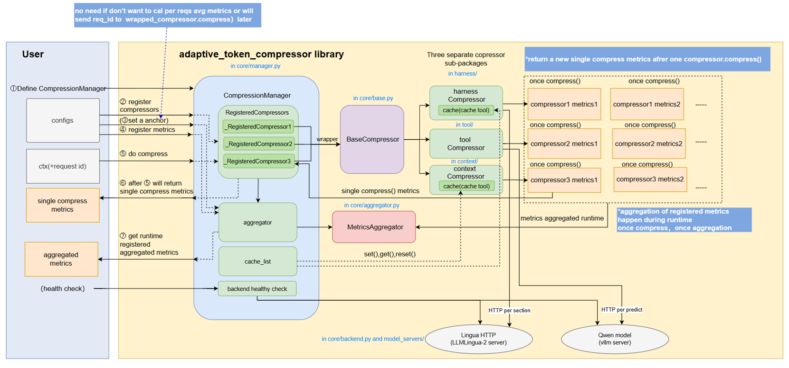
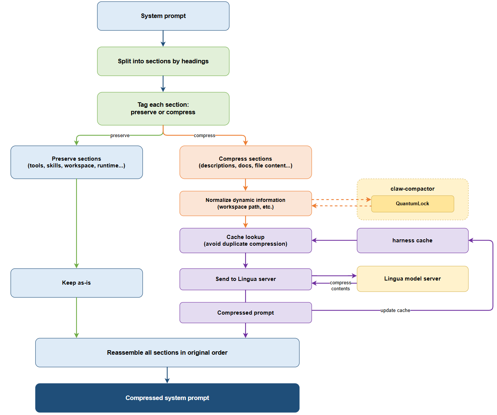
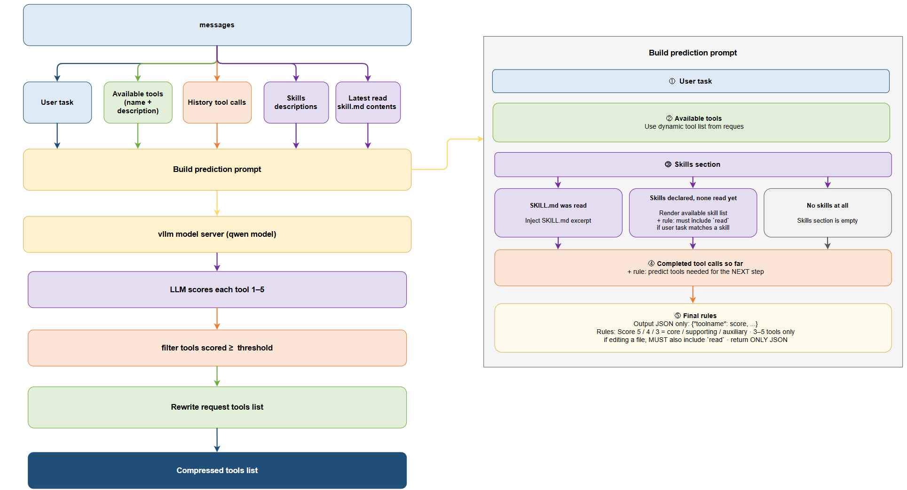

# Adaptive Token Compressor — Guide

This guide covers compressor principles and workflow, configuration reference,
available metrics, testing, FAQ, and resources. For installation and a quick
start, see the [README](README.md).

## Compressor Principles and Workflow

This section explains how each compressor works conceptually and what the
runtime pipeline looks like.



### HarnessCompressor

**Principle**

HarnessCompressor focuses on conversation-message compression for the prompt
assembly stage. It combines lightweight rules (message slicing / role-aware
handling) with Lingua-based lossy compression for long text blocks, so token
cost drops while preserving instruction-critical content.



**Workflow**

1. Input: chat messages (`system`, `developer`, `user`, `assistant`, `tool`).
2. Role-aware preprocessing: split and normalize message segments according to
    profile strategy.
3. Routing decision: short or sensitive spans are kept; compressible spans are
    sent to backend compression.
4. Backend compression: Lingua (default) applies token-budget reduction with
    digit-preservation controls.
5. Merge and output: reassemble compressed messages + emit metrics.

### ToolCompressor

**Principle**

ToolCompressor reduces tool-schema prompt cost by selecting only likely-needed
tools for the current request. It uses an external predictor LLM to score tool
relevance from conversation context, then keeps high-value tools only.



**Workflow**

1. Input: current messages + full candidate tool list.
2. Prompt construction: build predictor prompt from user intent and tool
    descriptions.
3. Relevance scoring: predictor model returns per-tool likelihood/importance.
4. Selection: apply threshold/ranking policy to keep top tools.
5. Metrics: record token savings, call count, and latency.

## Configuration Reference

### Lingua Server Configuration

Lingua server supports both `llmlingua2` and `longllmlingua` in one running
instance. `LINGUA_MODE` sets the startup default only; request
payload `mode` can override it per `/compress` call.

#### Docker Compose Environment Variables

| Parameter | Default | Allowed / Notes |
|-----------|---------|-----------------|
| `LINGUA_BACKEND` | `pytorch` | `pytorch` or `ov` |
| `LINGUA_DEVICE` | `xpu` | `xpu`, `cpu`, `cuda` (`cuda` is PyTorch-only) |
| `LINGUA_XPU_INDEX` | `0` | Used when `LINGUA_DEVICE=xpu`,specify the XPU index. For OpenVINO, maps to `GPU.<index>`; when index is `0`, generic `GPU` is also accepted as a compatibility fallback |
| `LINGUA_MODE` | `llmlingua2` | Startup default mode: `llmlingua2` or `longllmlingua` |
| `LINGUA_MODEL_NAME_ID` | empty | Optional fixed model id. Empty -> mode-specific defaults |
| `LINGUA_PORT` | `8001` | Host port mapping for `lingua-pytorch` service |
| `LINGUA_OV_PORT` | `8002` | Host port mapping for `lingua-ov` service |
| `LINGUA_HOST` | `0.0.0.0` | Bind address for the container service |

Mode-specific default models when `LINGUA_MODEL_NAME_ID` is empty:

- `llmlingua2` -> `microsoft/llmlingua-2-bert-base-multilingual-cased-meetingbank`
- `longllmlingua` -> `NousResearch/Llama-2-7b-hf`

### HarnessCompressor Configuration

| Parameter | Type | Default | Description |
|-----------|------|---------|-------------|
| `profile` | str | `"openclaw"` | Compression profile (sectioning strategy) |
| `lingua_url` | str | `"http://localhost:8001/compress"` | Lingua server URL |
| `compress_rate` | float | `0.5` | Target compression rate (0.0-1.0) |
| `compress_min_chars` | int | `500` | Minimum chars to trigger compression |
| `timeout` | float | `60.0` | Backend request timeout (seconds) |
| `enable_quantum_lock` | bool | `False` | Enable Claw Compactor QuantumLock stabilization |

**Example:**

```python
from adaptive_token_compressor.harness import HarnessCompressor

compressor = HarnessCompressor(
    profile="openclaw",
    lingua_url="http://localhost:8001/compress",
    compress_rate=0.5,
    compress_min_chars=500,
    timeout=60.0
)
```

### ToolCompressor Configuration

| Parameter | Type | Default | Description |
|-----------|------|---------|-------------|
| `predictor_url` | str | **Required** | Tool predictor LLM endpoint (e.g., vLLM `/v1/chat/completions`) |
| `predictor_model` | str | `"Qwen/Qwen3.6-35B-A3B"` | Model used by predictor |
| `score_threshold` | float | `3.0` | Minimum score for tool selection |
| `timeout` | int | `120` | Predictor request timeout (seconds) |
| `prompt_mode` | Literal | `"dynamic"` | `"static"` (fixed prompt) or `"dynamic"` (context-aware prompt) |
| `tool_descriptions_mode` | Literal | `"dynamic"` | `"static"` (default descriptions) or `"dynamic"` (extract from messages) |
| `placement` | Literal | `"schema"` | Where the predicted tool schema is placed. See **Placement modes** below. |
| `accumulate` | bool | `True` | Union the predicted tool set per conversation (append-only, never removed/reordered) so each turn's tool block is a strict prefix-extension of the previous turn's — keeping the prefix cache stable while still admitting tools that only emerge in later turns. Required by `user_inline_delta`. |

**Placement modes:**
- `"schema"` (default, production): predicted subset returned in `result.tools`, rendered inside the system message's `<tools>` block by the chat template.
- `"user_inline_delta"`: tools appended as a trailing synthetic user message. carrier persisted per-conversation and re-spliced at a fixed offset each turn (prefix-cache stable), but delta-only — appends a carrier only when new tools appear, carrying just the delta over the running union. Requires accumulate=True.


**Note:**
- `schema` + `accumulate=True`: reduces tool-schema tokens while keeping the prefix-cache hit rate from dropping significantly.
- `user_inline_delta` + `accumulate=True`: reduces tokens while further improving the prefix-cache hit rate (still lower than baseline). This depends on the tool-predictor model's own capability; verified to run stably on Qwen3.5-35B.

**Example:**

```python
from adaptive_token_compressor.tool import ToolCompressor

compressor = ToolCompressor(
    predictor_url="http://localhost:8000/v1/chat/completions",
    predictor_model="Qwen/Qwen3.6-35B-A3B",
    score_threshold=3.0,
    timeout=120,
    prompt_mode="dynamic",
    tool_descriptions_mode="dynamic",
    placement="schema"
)
```

## Available Metrics

The library provides 15 metric types for tracking compression performance. Most metrics require a `sources` parameter specifying which compressor(s) to track (e.g., `"harness"`, `"tool"`, or `["harness", "tool"]`). The exception is `RequestCount`, which is source-agnostic.

### First-Order Metrics (Direct Aggregation)

| Metric | Description | Formula |
|--------|-------------|---------|
| `CallCount` | Total number of compression calls | Sum of all calls |
| `TotalInput` | Total input tokens | Sum of `tokens_before` |
| `TotalOutput` | Total output tokens | Sum of `tokens_after` |
| `TotalSaved` | Total tokens saved | Sum of `saved_tokens` |
| `TotalDuration` | Total compression time | Sum of `duration_ms` |

**Example:**
```python
manager.register_metric("total_calls", CallCount(sources="harness"))
manager.register_metric("total_saved", TotalSaved(sources=["harness", "tool"]))
```

### Second-Order Metrics (Per-Call Averages)

| Metric | Description | Formula |
|--------|-------------|---------|
| `CompressionRatio` | Compression ratio (lower = better) | `sum(tokens_after) / sum(tokens_before)` |
| `AvgSavedPerCall` | Average tokens saved per call | `sum(saved_tokens) / call_count` |
| `AvgDurationPerCall` | Average duration per call | `sum(duration_ms) / call_count` |
| `AvgInputPerCall` | Average input tokens per call | `sum(tokens_before) / call_count` |
| `AvgOutputPerCall` | Average output tokens per call | `sum(tokens_after) / call_count` |

**Example:**
```python
manager.register_metric("ratio", CompressionRatio(sources="harness"))
manager.register_metric("avg_saved", AvgSavedPerCall(sources="tool"))
```

### Third-Order Metrics (Per-Request Averages)

These require passing `req_id` to `compress()` or using `manager.set_per_anchor()`.

| Metric | Description | Formula |
|--------|-------------|---------|
| `AvgSavedPerRequest` | Average tokens saved per request | `sum(saved_tokens) / unique_requests` |
| `AvgDurationPerRequest` | Average duration per request | `sum(duration_ms) / unique_requests` |
| `AvgInputPerRequest` | Average input tokens per request | `sum(tokens_before) / unique_requests` |
| `AvgOutputPerRequest` | Average output tokens per request | `sum(tokens_after) / unique_requests` |
| `RequestCount` | Number of unique requests (source-agnostic) | `len(unique req_ids)` (or anchor count) |

> **Note**: `RequestCount` is the only metric without a `sources` parameter — it counts requests across the whole manager, not per-compressor calls. Construct it with no arguments: `RequestCount()`.

**Example:**
```python
manager.register_metric("avg_per_req", AvgSavedPerRequest(sources="harness"))
manager.register_metric("request_count", RequestCount())  # no sources arg

# Option 1: Pass req_id explicitly
harness_compressor.compress(ctx, req_id="request-123")

# Option 2: Use anchor fallback
manager.set_per_anchor("harness")
```

## Testing

```bash
# Run all tests
pytest

# Specific module
pytest tests/core/test_metrics.py

# With coverage
pytest --cov=adaptive_token_compressor
```

## FAQ

### Q: What's required to use each compressor?

**HarnessCompressor**: 
- Lingua Server (required)
- Claw Compactor (optional, recommended for better quality)

**ToolCompressor**:
- LLM endpoint for tool prediction (required, e.g., vLLM chat completions)


### Q: What is Claw Compactor?

A content-type detection library that routes different content types (code, JSON, text, search results) to optimal compression strategies. Used by HarnessCompressor for enhanced compression quality.

### Q: What happens if I don't install Claw Compactor?

`HarnessCompressor` will fall back to basic Lingua compression for all content types. You'll still get compression, but without content-type-specific optimizations (less optimal for code, JSON, structured data).

### Q: How does digit protection work?

A patched version of LLMLingua-2 identifies digits and protects them plus surrounding words (default: 3 before and after) from deletion during compression. This prevents numerical data loss in benchmarks, PDFs, and data-heavy content.


### Q: How do I chain multiple compressors?

Pass the `CompressionContext` through each compressor:

```python
ctx = CompressionContext(messages=messages, tools=tools)
ctx = manager.compress("tool", ctx)      # Filter tools
ctx = manager.compress("harness", ctx)   # Compress messages
# Use ctx.messages and ctx.tools
```

## Resources

- [LongLLMLingua: Accelerating and Enhancing LLMs in Long Context Scenarios via Prompt Compression](https://aclanthology.org/2024.acl-long.91/)
- [LLMLingua-2: Data Distillation for Efficient and Faithful Task-Agnostic Prompt Compression](https://arxiv.org/abs/2403.12968)
- [Lingua Deployment Guide](deployment/lingua/README.md)
- [Tool Predictor Setup](deployment/tool_predictor/README.md)