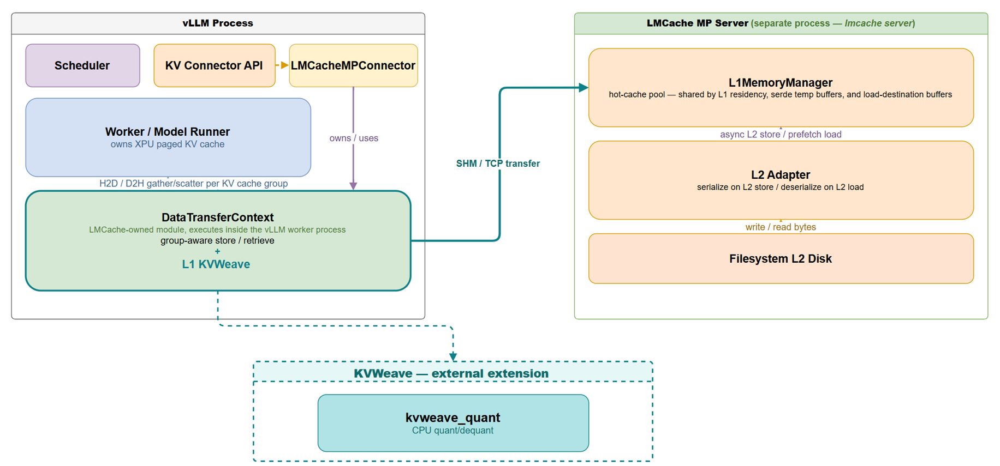
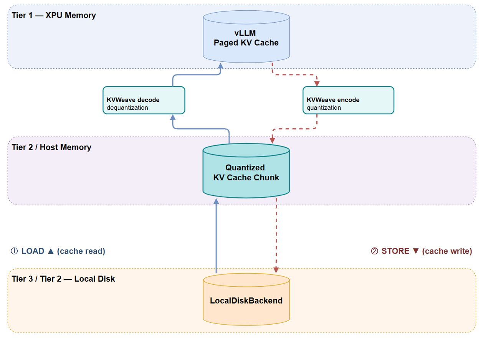

# SPDX-FileCopyrightText: (C) 2026 Intel Corporation
# SPDX-License-Identifier: Apache-2.0

# KVCache Quantization and Offload Library

KVCache Quantization and Offload Library is a near-lossless 4-bit KV-cache quantization codec for LMCache/vLLM,
purpose-built for offloading KV caches from xpu memory to host memory / disk
on edge devices — restoring prefix-cache hits that would otherwise be lost to
memory pressure.

## Features

- Near-lossless 4-bit KV-cache quantization built on Randomized Hadamard
  Transform (RHT) preconditioning, tuned for edge accelerator deployments.
- Configurable scaling methods (`per_tensor` / `per_channel` / `per_token`),
  optional asymmetric quantization, and optional RHT preconditioning.
- CPU kernels (AVX2 or AVX-512, with optional OpenMP multithreading) plus an
  optional standalone SYCL/DPC++ kernel for Intel XPUs.
- Drop-in codec for LMCache's serde interface — stays
  transparent to vLLM's serving path.


## Prerequisites

- Python >= 3.10.
- PyTorch (`torch`, `numpy` — base dependencies).
- A C++17 compiler. Builds against AVX2 by default; set `KVWEAVE_ISA=avx512`
  on hosts with AVX-512 FP16/BF16 support.
- Optional: the Intel oneAPI DPC++ compiler (`icpx` in `PATH`) — only needed
  for `KVWEAVE_COMPILER=icpx` or to build the XPU kernels (`KVWEAVE_XPU=1`).
- Optional: the `lmcache` package (`pip install ".[lmcache]"`) — needed to use
  the LMCache serde plugin.
- Docker — needed to run the Docker-based vLLM + LMCache + KV quant offload deployment
  in [Quick Start](#quick-start).


## Architecture

### Why vLLM and LMCache

vLLM is the de-facto high-throughput serving engine with paged KV-cache
management; LMCache adds a layer that reuses KV caches across an
XPU-host-disk hierarchy. Together they give production-grade serving with
tiered offloading.

### Integrating with LMCache

LMCache does not offer KV-cache quantization for L1 storage level (host memory). This library closes that gap through the
bundled `kvweave` codec, plugged into LMCache's codec interface. The codec brings a novel quantization algorithm
with near-zero accuracy loss, optimized for Intel platforms; it stays
transparent to the serving engine while shrinking payloads to ease disk-I/O
pressure.



### Data flow

During prefill, vLLM produces KV caches on the XPU. LMCache moves each chunk
off the device and passes it through the `kvweave` codec, which quantizes it
once and writes the compact payload to the host and disk tiers. When a later
request reuses that context, LMCache retrieves the payload, the `kvweave` codec
dequantizes it, and the reconstructed KV cache is loaded back to the XPU —
turning what would have been a full prefill into a cache hit served from disk.



## Repository layout

```
setup.py                  Build script for the kvweave.kvweave_quant extension
kvweave/                  Python package the compiled extensions install into
kvweave/csrc/             Core C++ quantize/dequantize kernels (CPU + XPU/SYCL)
kvweave/bindings/         pybind11 wrappers exposing kvweave/csrc/ as Python extensions
docs/assets/              README images and other static documentation assets
integration/lmcache/      Docker-based vLLM + LMCache + KV quant offload deployment scripts
tests/                    Quantization accuracy/perf and serde unit tests, vllm-curl.sh smoke test
```

## Install

Build the CPU extension (`kvweave.kvweave_quant`):

```bash
pip install .
```

Environment variables recognized by `setup.py`:
- `KVWEAVE_ISA` (`avx2` default, or `avx512` on hosts with AVX-512 FP16/BF16 support)
- `KVWEAVE_COMPILER` (`default`, or `icpx` to build with the Intel oneAPI compiler)
- `KVWEAVE_MULTITHREAD` (`1` default, set `0` to disable OpenMP)
- `KVWEAVE_XPU` (`0` default; set `1` to also build `kvweave.kvweave_quant_xpu`, the
  SYCL/DPC++ quantize/dequantize kernels for Intel GPUs. Requires the Intel
  oneAPI DPC++ compiler (`icpx`) in `PATH` and a PyTorch build with XPU
  support; forces `CC=icx`/`CXX=icpx` regardless of `KVWEAVE_COMPILER`. This
  module is standalone — it is not wired into the LMCache serde/codec path.)


## Quick Start

`integration/lmcache/vllm/vllm-start.sh` launches a Docker container that
clones LMCache v0.4.7, applies `integration/lmcache/patches/lmcache-mp-hybrid.patch`
and `integration/lmcache/patches/lmcache-v0.4.7-mp-hybrid-to-kvweave.patch`
(which together add MP-hybrid support and the `kvweave` codec), builds
`kvweave_quant` inside the container, starts an LMCache MP server, and then
starts vLLM's OpenAI-compatible API server wired to it via `LMCacheMPConnector`.

```bash
MODEL_PATH=/path/to/models bash integration/lmcache/vllm/vllm-start.sh
```

Then smoke-test the running server:

```bash
bash tests/vllm-curl.sh
```


## License

Apache License 2.0 — see [LICENSE](LICENSE).
