# How It Works

This page describes the architecture and internal flow of an audio request
through the microservice.

## Architecture

At a high level, the Audio Analyzer is a FastAPI service that accepts an
audio upload, splits it into chunks with FFmpeg, runs each chunk through an
ASR backend, and (optionally) runs a sentiment model in parallel. Results
are aggregated per session and returned as a single JSON response, an
OpenAI-compatible SSE stream, or an NDJSON event stream. The service also
accepts a continuous live audio feed over WebSocket (`/v1/realtime`), where
voice activity detection — rather than file boundaries — decides where each
transcribed utterance ends.

```mermaid
%%{init: {
  'theme': 'base',
  'themeVariables': {
    'fontFamily': '"IntelOne Display", "Intel Clear", "Inter", "Segoe UI", Arial, sans-serif',
    'fontSize': '14px',
    'primaryColor': '#0068B5',
    'primaryTextColor': '#FFFFFF',
    'primaryBorderColor': '#00377C',
    'lineColor': '#00377C',
    'secondaryColor': '#EEF3F8',
    'tertiaryColor': '#F7F8FA',
    'background': '#FFFFFF',
    'mainBkg': '#FFFFFF',
    'clusterBkg': '#F7F8FA',
    'clusterBorder': '#0068B5',
    'edgeLabelBackground': '#FFFFFF',
    'noteBkgColor': '#F7F8FA',
    'noteTextColor': '#3A3A3A'
  }
}}%%
flowchart LR
    Client([Client])

    subgraph Service["Audio Analyzer (FastAPI, :8010)"]
        API["API Layer<br/>(transcription / realtime / health / devices)"]
        Pipeline["Pipeline Orchestrator<br/>(pipeline.py)"]
        VAD["Realtime Buffer + VAD<br/>(utils/pcm_audio.py)"]
        Pre["Preprocessing<br/>(FFmpeg: decode, chunk, denoise)"]
        ASR["ASR Backend<br/>(openai | openvino | whispercpp)"]
        Sent["Sentiment Backend<br/>(openvino | pytorch)"]
        Session[("Session Store<br/>storage/&lt;session_id&gt;/")]
    end

    Models[("Model Cache<br/>models/")]
    Device{{"Inference Device<br/>CPU / GPU"}}

    Client -- "POST /v1/audio/transcriptions{,/stream}" --> API
    Client -- "WS /v1/realtime (PCM16 frames)" --> API
    API --> VAD
    VAD -- "committed utterance" --> Pipeline
    API --> Pipeline
    Pipeline --> Pre
    Pre --> ASR
    Pre --> Sent
    ASR --> Device
    Sent --> Device
    ASR --> Pipeline
    Sent --> Pipeline
    Pipeline <--> Session
    ASR -. loads .-> Models
    Sent -. loads .-> Models
    Pipeline -- "JSON response / NDJSON events<br/>X-Session-ID header" --> Client

    classDef client fill:#FFFFFF,stroke:#0068B5,stroke-width:2px,color:#3A3A3A;
    classDef core fill:#0068B5,stroke:#00377C,stroke-width:1.5px,color:#FFFFFF;
    classDef backend fill:#00A3F4,stroke:#00377C,stroke-width:1.5px,color:#FFFFFF;
    classDef store fill:#6C6C6C,stroke:#0068B5,stroke-width:1.5px,color:#FFFFFF;
    classDef device fill:#00C7FD,stroke:#00377C,stroke-width:1.5px,color:#3A3A3A;

    class Client client;
    class API,Pipeline,Pre,VAD core;
    class ASR,Sent backend;
    class Session,Models store;
    class Device device;

    style Service fill:#F7F8FA,stroke:#0068B5,stroke-width:1.5px,color:#3A3A3A;
```

**Key planes:**

- **API layer** — request validation, session header handling, response
  shaping (single JSON, OpenAI-compatible SSE, or NDJSON), and the realtime
  WebSocket event protocol.
- **Pipeline orchestrator** — drives preprocessing, ASR, and sentiment;
  aggregates per-chunk results into a session-level summary.
- **Backends** — pluggable ASR and sentiment implementations selected via
  config; each backend handles its own model loading and device placement.
- **Session store** — per-session directory holding chunk files and
  metadata; enables multi-upload continuation via `session_id`.

## Request Flow

The service supports two distinct ingestion modes: **file-based** (a finite
upload, transcribed chunk by chunk) and **live** (an open-ended PCM stream
over WebSocket, transcribed utterance by utterance).

### File-based ingestion

1. **Upload** — A client sends an audio file to
   `POST /v1/audio/transcriptions` (single JSON response, or
   OpenAI-compatible SSE when `stream=true`) or
   `POST /v1/audio/transcriptions/stream` (NDJSON event stream).
2. **Session resolution** — If `session_id` is supplied, the service reuses
   the existing session directory under `storage/<session_id>/`. Otherwise, it
   creates a new session and returns the id in the `X-Session-ID` response
   header.
3. **Preprocessing** — FFmpeg decodes the upload and produces audio chunks
   under the configured `audio_preprocessing.chunk_dir`. Chunk size, silence
   detection, and optional denoising are controlled by the
   `audio_preprocessing` config section.
4. **ASR inference** — Each chunk is transcribed by the configured ASR
   backend (`openai`, `openvino`, or `whispercpp`) on the configured device
   (typically `CPU`; `GPU` is available only for supported OpenVINO paths).
5. **Sentiment (optional)** — When `sentiment.enabled` is true, the
   service runs the configured sentiment model (`openvino` or `pytorch`) and
   aggregates a session-level summary.
6. **Response** — The non-streaming endpoint returns a final response object.
   The NDJSON endpoint emits `transcription.chunk` events as each chunk
   completes and a final `transcription.completed` event. With `stream=true`,
   `POST /v1/audio/transcriptions` instead emits OpenAI-compatible SSE
   (`transcript.text.delta` → `transcript.text.done` → `[DONE]`).
7. **Cleanup** — If `pipeline.delete_chunks_after_use` is true, temporary
   chunk files are removed after processing. Session metadata remains under
   `storage/<session_id>/`.

### Live ingestion (WebSocket)

`WS /v1/realtime` accepts a continuous audio feed rather than a finite
upload, so chunking is driven by speech activity instead of file boundaries:

1. **Connect** — The client opens the socket and receives
   `transcription_session.created` describing the negotiated audio format
   (PCM16, mono, 16 kHz by default).
2. **Append** — The client pushes base64 PCM16 frames via
   `input_audio_buffer.append` into a server-side rolling buffer.
3. **Turn detection** — An energy-based VAD watches the buffer and emits
   `speech_started` / `speech_stopped`. A sustained silence run closes the
   utterance; clients may instead disable VAD and commit boundaries
   explicitly with `input_audio_buffer.commit`.
4. **Transcription** — Each committed utterance is written to a temporary WAV
   and pushed through the same ASR pipeline used by file ingestion, so
   backend, device, and sentiment configuration behave identically.
   Transcription is serialized per socket so results stay in order, and runs
   in a thread pool to keep the event loop responsive.
5. **Emit** — The service sends
   `conversation.item.input_audio_transcription.delta` followed by
   `.completed` for each utterance. Because the socket's segments share one
   session, the session transcript accumulates across the whole connection.

Live ingestion deliberately does not capture from a local microphone: the
service is containerized and has no reliable host audio device, so the client
owns capture and the service owns transcription.

## Components

- `api/` — FastAPI routers: `openai_endpoints.py` (OpenAI-compatible
  transcription and SSE), `realtime_endpoints.py` (live WebSocket streaming),
  and `custom_endpoints.py` (health, devices, and VSS-compatible routes).
- `pipeline.py` — Orchestrates preprocessing, ASR, and sentiment.
- `components/` — Backend implementations for ASR and sentiment providers.
- `utils/` — Audio utilities (including `pcm_audio.py` for PCM/VAD and
  `subtitle_format.py` for SRT/VTT), config loading, and session helpers.
- `dto/` — Request and response data models.

## Configuration Surface

All runtime behavior is driven by `config.yaml`, shared by both standalone
and container runs, with targeted overrides via `AUDIO_ANALYZER__...`
environment variables. See the [Configuration Guide](./get-started/configuration.md) for the
full list of fields.
