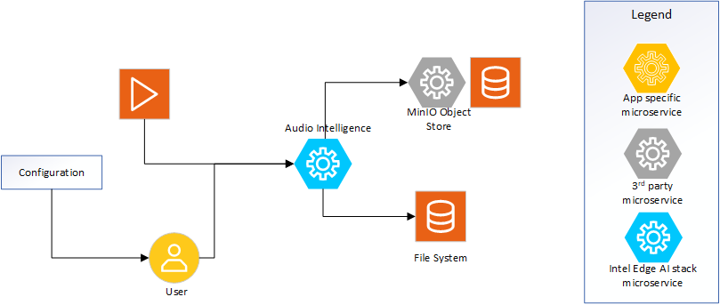

# Overview and Architecture

The Audio Intelligence microservice provides capability to transcribe audio from input video file. 

## Architecture Overview

### High-Level Architecture Diagram
  
*Figure 1: High-level system view demonstrating the microservice.*


### Inputs
* **Video file**: Provides reference to the video file to be used as input. The file can be ingested from file system or from MinIO store.
* **API Requests**: REST API calls for operations such as Whisper model selection, Health, and generating transcription.

### Processing Pipeline
* **Transcription**: The transcription process involves demuxing to get the audio channel in the input video file and providing the same to the Whisper model for transcription. The transcription process follows the well documented Whisper model internals.

### Outputs
* **API Responses**: Provides feedback on operations, including success or error messages, and returns output for the requested API call.

## API Endpoints

### Health Check

```
GET /api/v1/health
```

Returns the status of the API service.

### Speech Transcription

```
POST /api/v1/transcriptions
```

Transcribes speech from a video file using either direct upload or a MinIO source.

**Request Parameters (Two ways to provide video source)**:

Option 1: Direct File Upload
- `file`: The video file to transcribe

Option 2: MinIO Source
- `minio_bucket`: Name of the MinIO bucket where the video is stored
- `video_id`: ID/prefix of the video in the bucket (optional)
- `video_name`: Name of the video file in the bucket

**Common Parameters**:
- `include_timestamps` (optional): Whether to include timestamps in the output (default: true)
- `device` (optional): Compute device to use - 'cpu', 'gpu', or 'auto' (default: from settings)
- `model_name` (optional): Name of the whisper model to use (default: from settings)
- `language` (optional): Language code for transcription

**Example Response**:
```json
{
  "status": "completed",
  "message": "Transcription completed successfully",
  "job_id": "1234-5678-90ab-cdef",
  "transcript_path": "minio://video_19/audio_description/1234-5678.srt",
  "video_name": "example.mp4",
  "video_duration": 120.5
}
```

## Supporting Resources
* [Get Started Guide](get-started.md)
* [API Reference](api-reference.md)
* [System Requirements](system-requirements.md)
