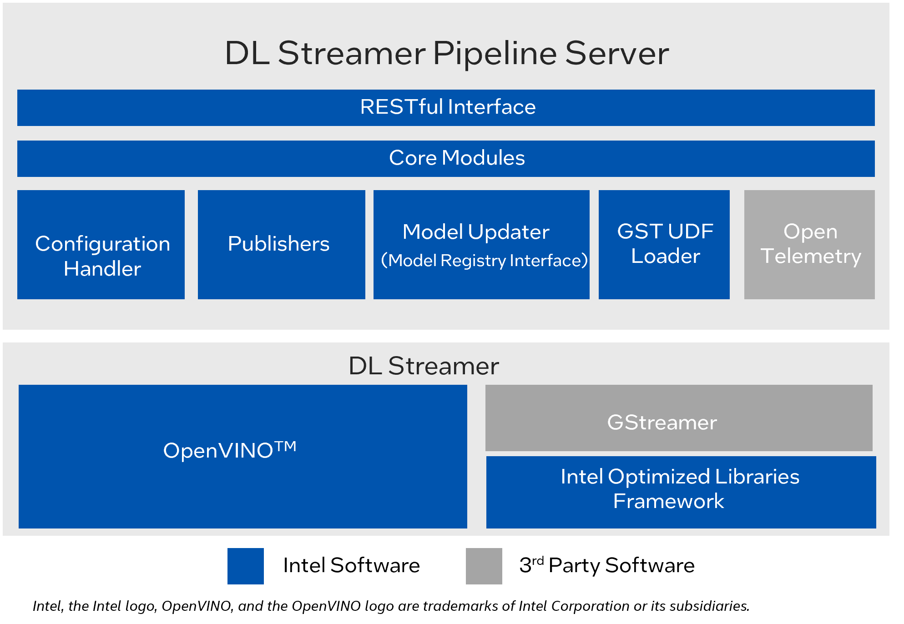
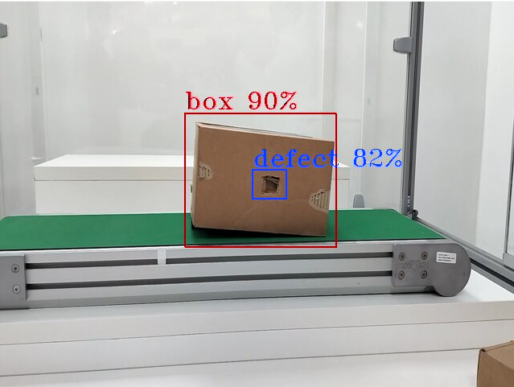

# Contents

- [Contents](#contents)
  - [Deep Learning Streamer Pipeline Server](#deep-learning-streamer-pipeline-server)
    - [Overview](#overview)
    - [Architecture](#architecture)
  - [Prerequisites For Target System](#prerequisites-for-target-system)
  - [Quick try out ](#quick-try-out)
      - [Pull the docker image and start container](#pull-the-image-and-start-container)
      - [Run default sample](#run-default-sample)
  - [Build from source](#build-from-source)
      - [Prerequisites](#prerequisites)
      - [Build Deep Learning Streamer Pipeline Server Image and start container](#build-image-and-start-container)
      - [Run default sample](#run-default-sample-1)
  - [Learn More](#learn-more)

# Deep Learning Streamer Pipeline Server <a name="deep-learning-streamer-pipeline-server"></a>

## Overview

Deep Learning Streamer Pipeline Server (DL Streamer Pipeline Server) is a Python-based, interoperable containerized microservice for easy development and deployment of video analytics pipelines. It is built on top of [GStreamer](https://gstreamer.freedesktop.org/documentation/) and [Deep Learning Streamer (DL Streamer)](https://dlstreamer.github.io/) , providing video ingestion and deep learning inferencing functionalities.

Video analytics involves the conversion of video streams into valuable insights through the application of video processing, inference, and analytics operations. It finds applications in various business sectors including healthcare, retail, entertainment, and industrial domains. The algorithms utilized in video analytics are responsible for performing tasks such as object detection, classification, identification, counting, and tracking on the input video stream.


Note - The detailed documentation of Deep Learning Streamer Pipeline Server can be found [here](https://docs.openedgeplatform.intel.com/edge-ai-libraries/dlstreamer-pipeline-server/main/user-guide/Overview.html)

## Architecture



## Prerequisites For Target System

- [System Requirements](./docs/user-guide/system-requirements.md)

## Quick try out

Follow the steps in this section to quickly pull the latest pre-built Deep Learning Streamer Pipeline Server docker image followed by running a sample usecase. 

### Pull the image and start container

- Pull the image with the latest tag from registry

   ```sh
     docker pull intel/dlstreamer-pipeline-server:3.1.0
   ```

- Clone the repository and change to the docker directory inside DL Streamer Pipeline Server project.

  ```sh
    git clone <link-to-repository>
    cd <path/to/dlstreamer-pipeline-server/docker>
  ```

- Run the image with the [compose file](./docker/docker-compose.yml) provided in this repo.

   ```sh
     docker compose up
   ```

### Run default sample

Once the container is up, we will send a pipeline request to Deep Learning Streamer Pipeline Server to run a detection model on a warehouse video. Both the model and video are provided as default sample in the docker image.

We will send the below curl request to run the inference.
It comprises of a source file path which is `warehouse.avi`, a destination, with metadata directed to a json fine in `/tmp/resuts.jsonl` and frames streamed over RTSP with id `pallet-defect-detection`. Additionally, we will also provide the GETi model path that would be used for detecting defective boxes on the video file.

Open another terminal and send the following curl request
``` sh
    curl http://localhost:8080/pipelines/user_defined_pipelines/pallet_defect_detection -X POST -H 'Content-Type: application/json' -d '{
    "source": {
        "uri": "file:///home/pipeline-server/resources/videos/warehouse.avi",
        "type": "uri"
    },
    "destination": {
        "metadata": {
            "type": "file",
            "path": "/tmp/results.jsonl",
            "format": "json-lines"
        },
        "frame": {
            "type": "rtsp",
            "path": "pallet-defect-detection"
        }
    },
    "parameters": {
        "detection-properties": {
            "model": "/home/pipeline-server/resources/models/geti/pallet_defect_detection/deployment/Detection/model/model.xml",
            "device": "CPU"
        }
    }
}'
```

The REST request will return a pipeline instance ID, which can be used as an identifier to query later the pipeline status or stop the pipeline instance. For example, a6d67224eacc11ec9f360242c0a86003.

- To view the metadata, open another terminal and run the following command,
  ```sh
    tail -f /tmp/results.jsonl
  ```

- RTSP Stream will be accessible at `rtsp://<SYSTEM_IP_ADDRESS>:8554/pallet-defect-detection`.  Users can view this on any media player e.g. vlc (as a network stream), ffplay etc 

  

To check the pipeline status and stop the pipeline send the following requests,

 - view the pipeline status that you triggered in the above step.
   ```sh
    curl --location -X GET http://localhost:8080/pipelines/status
   ```

 - stop a running pipeline instance, 
   ```sh
    curl --location -X DELETE http://localhost:8080/pipelines/{instance_id}
   ```

Now you have successfully run the Deep Learning Streamer Pipeline Server container, sent a curl request to start a pipeline within the microservice which runs the Geti based pallet defect detection model on a sample warehouse video. Then, you have also looked into the status of the pipeline to see if everything worked as expected and eventually stopped the pipeline as well.

---
## Build from source 

You can build either an optimized or an extended DL Streamer Pipeline Server image (for both Ubuntu22 and Ubuntu24) based on your use case. The extended image contains the Geti SDK, the OpenVINO Model API and ROS2 on top of the optimized image.

### Prerequisites
Add the following lines in [.env file](./docker/.env) if you are behind a proxy.

  ``` sh
  http_proxy= # example: http_proxy=http://proxy.example.com:891
  https_proxy= # example: https_proxy=http://proxy.example.com:891
  no_proxy= # example: no_proxy=localhost,127.0.0.1
  ```

Update the following lines in [.env file](./docker/.env) for choosing the right base image and also for naming the image that gets built.

  ``` sh
  # For Ubuntu 22.04: ghcr.io/open-edge-platform/edge-ai-libraries/deb-final-img-ubuntu22:candidate1407
  # For Ubuntu 24.04: ghcr.io/open-edge-platform/edge-ai-libraries/deb-final-img-ubuntu24:candidate1407
  BASE_IMAGE=

  # For Ubuntu 22.04 and optimized image: intel/dlstreamer-pipeline-server:3.1.0-ubuntu22
  # For Ubuntu 24.04 and optimized image: intel/dlstreamer-pipeline-server:3.1.0-ubuntu24
  # For Ubuntu 22.04 and extended image: intel/dlstreamer-pipeline-server:3.1.0-extended-ubuntu22
  # For Ubuntu 24.04 and extended image: intel/dlstreamer-pipeline-server:3.1.0-extended-ubuntu24
  DLSTREAMER_PIPELINE_SERVER_IMAGE=

  # For optimized image: dlstreamer-pipeline-server
  # For extended image: dlstreamer-pipeline-server-extended
  BUILD_TARGET=
  ```

  Note: If you do not have access to the above mentioned `BASE_IMAGE`, then you can build [DL Streamer docker image from source](https://github.com/open-edge-platform/edge-ai-libraries/tree/main/libraries/dl-streamer#build-the-dlstreamer-docker-image-with) and use it as `BASE_IMAGE` in the above mentioned `.env` file

### Build Deep Learning Streamer Pipeline Server image and start container <a name="build-image-and-start-container"></a>

Run the following commands:

   ```sh
     cd docker
     source .env # sometimes this is needed as docker compose doesn't always pick up the necessary env variables
     docker compose build
   ```
   
   The docker image `intel/dlstreamer-pipeline-server:3.1.0-ubuntu22`, `intel/dlstreamer-pipeline-server:3.1.0-ubuntu24`, `intel/dlstreamer-pipeline-server:3.1.0-extended-ubuntu22` or `intel/dlstreamer-pipeline-server:3.1.0-extended-ubuntu24` is now built (based on the .env changes done above) and available for you to run.
   
   ```sh
     docker compose up
   ```

---
### Run default sample
Refer [here](https://docs.openedgeplatform.intel.com/edge-ai-libraries/dlstreamer-pipeline-server/main/user-guide/get-started.html) to run default sample upon bringing up Intel® Deep Learning Streamer Pipeline Server container.

---
## Legal compliance: Build a docker image containing sources for GPL/LGPL/AGPL binary distributed components

  ```sh
    docker build -f sources.Dockerfile -t intel/dlstreamer-pipeline-server:3.1.0-sources .
  ```

  Run the following command to view the directory structure of source code for distributed GPL/LGPL/AGPL components:
  ```sh
    docker run intel/dlstreamer-pipeline-server:3.1.0-sources
  ```
---

## Learn More

-   Understand the components, services, architecture, and data flow, in the [Overview](https://docs.openedgeplatform.intel.com/edge-ai-libraries/dlstreamer-pipeline-server/main/user-guide/Overview.html)
-   For more details on advanced configuration, usage of features refer to [Advanced User Guide](https://docs.openedgeplatform.intel.com/edge-ai-libraries/dlstreamer-pipeline-server/main/user-guide/advanced-guide/Overview.html). 
-   For more tutorials refer [here](https://docs.openedgeplatform.intel.com/edge-ai-libraries/dlstreamer-pipeline-server/main/user-guide/get-started.html)
