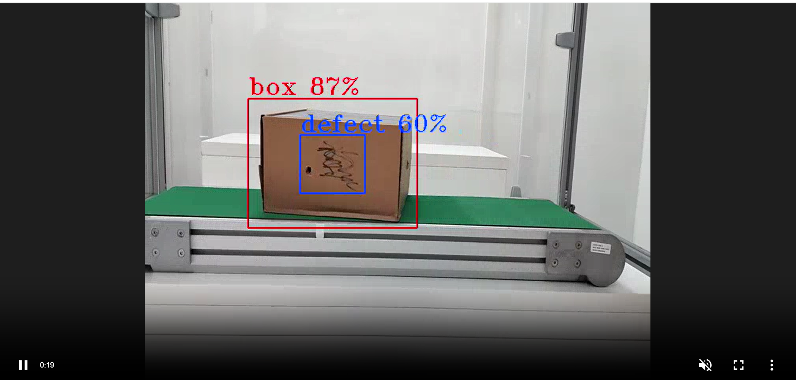

# WebRTC frame streaming

DL Streamer Pipeline Server supports streaming the frames on WebRTC protocol using mediamtx media server.
There is a dedicated docker compose file for demonstrating WebRTC streaming for DL Streamer Pipeline Server. It is available in DL Streamer Pipeline Server's github repository, under the "docker" folder i.e., `[WORKDIR]/edge-ai-libraries/microservices/dlstreamer-pipeline-server/docker/docker-compose-mediamtx.yml`
Below are the necessary configuration to be aware of (or modify accordingly based on your deployment) in `[WORKDIR]/edge-ai-libraries/microservices/dlstreamer-pipeline-server/docker/.env` (They will be consumed appropriately in `[WORKDIR]/edge-ai-libraries/microservices/dlstreamer-pipeline-server/docker/docker-compose-mediamtx.yml`):
```sh
WHIP_SERVER_IP=<HOST_IP> # It should be the IP address of the machine on which open mediamtx container is running.
WHIP_SERVER_PORT=8889 # It is the port which is configured for mediamtx server. Default port is 8889.
```
After setting all the above information, we can start the WebRTC streaming:
- Start the services
    ```sh
        docker compose -f docker-compose-mediamtx.yml up
    ```
- Open another terminal and start a pipeline in DL Streamer Pipeline Server with the below curl command.
    ```sh
        curl http://localhost:8080/pipelines/user_defined_pipelines/pallet_defect_detection -X POST -H 'Content-Type: application/json' -d '{
        "source": {
            "uri": "file:///home/pipeline-server/resources/videos/warehouse.avi",
            "type": "uri"
        },
        "destination": {
            "metadata": {
                "type": "file",
                "path": "/tmp/results.jsonl",
                "format": "json-lines"
            },
            "frame": {
                "type": "webrtc",
                "peer-id": "pallet-defect-detection"
            }
        },
        "parameters": {
            "detection-properties": {
                "model": "/home/pipeline-server/resources/models/geti/pallet_defect_detection/deployment/Detection/model/model.xml",
                "device": "CPU"
            }
        }
    }'
    ```
- Open `http://<HOST_IP>:8889/<peer-id>` in your browser to view the WebRTC stream:
    

`Note`: If you are using 4K or high resolution video make sure to increase the bitrate to avoid choppy video streaming. You can set the bitrate by adding `"bitrate" : 5000` with the webrtc configurations in your curl command.
- ```sh
    "frame": {
                    "type": "webrtc",
                    "peer-id": "pallet-defect-detection",
                    "bitrate": 5000
                }
    ```

`Note`: Mediamtx may fail to stream if the pipeline initialization takes longer than 10 seconds. To resolve this, you can increase the WHIP_SERVER_TIMEOUT value in the .env file located in the [WORKDIR]/edge-ai-libraries/microservices/dlstreamer-pipeline-server/docker/ directory.