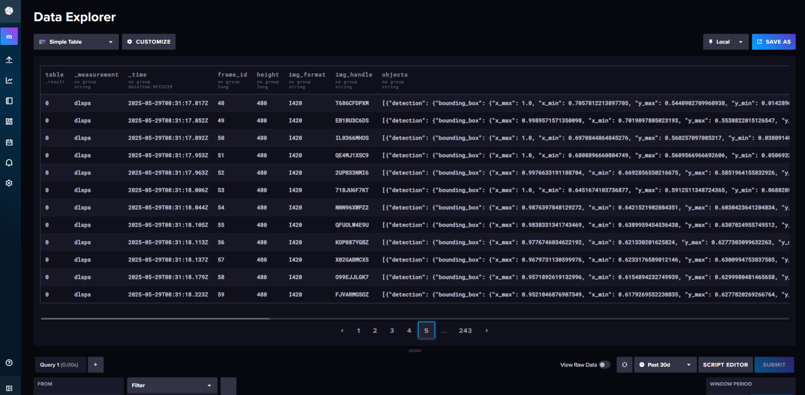

# How to publish metadata to InfluxDB

## Steps

DL Streamer Pipeline Server supports storing metadata of frames in InfluxDB.

First you must add server configuration details such as host, port, credentials, etc. as environment variables to DL Streamer Pipeline Server. 

If you are launching the service along with DL Streamer Pipeline Server, you should add the InfluxDB service details to DL Streamer Pipeline Server's docker-compose.yml file present at `[WORKDIR]/edge-ai-libraries/microservices/dlstreamer-pipeline-server/docker/docker-compose.yml`. For this tutorial we will be following this approach.


For the sake of demonstration, we will be using InfluxDB v2.7.11 to store the metadata and will be launched together with DL Streamer Pipeline Server. To get started, follow the steps below.

1. Modify environment variables in `[WORKDIR]/edge-ai-libraries/microservices/dlstreamer-pipeline-server/docker/.env` file.
    - Provide the InfluxDB details and credentials.

        ```sh
        INFLUXDB_HOST=influxdb
        INFLUXDB_PORT=8086
        INFLUXDB_USER=<DATABASE USERNAME> #example INFLUXDB_USER=influxadmin
        INFLUXDB_PASS=<DATABASE PASSWORD> #example INFLUXDB_PASS=influxadmin
        ```

2. Add influxdb service to the docker compose yml.
    - Modify the docker-compose.yml file with the following changes. Add `influxdb` service under `services` section. Modify the values as per your requirements.

        ```yaml
        services:
          influxdb:
            image: influxdb:latest
            container_name: influxdb
            hostname: influxdb
            ports:
              - "8086:8086"
            volumes:
              - influxdb:/var/lib/influxdb
            restart: unless-stopped
            networks:
              - app_network
        ```
    - Also add the `influxdb` in volume section of your docker-compose.yml

        ```yaml
        volumes:
            vol_pipeline_root:
                driver: local
                driver_opts:
                type: tmpfs
                device: tmpfs
            influxdb:
        ```

    - Update `no_proxy` environment section of DL Streamer Pipeline Server service by adding `influxdb` container name to `no_proxy` parameter present under `environment` section of `dlstreamer-pipeline-server` service.
        ```yaml
        services:
          dlstreamer-pipeline-server:
            environment:
              - no_proxy=$no_proxy,multimodal-data-visualization-streaming,${RTSP_CAMERA_IP},${OTEL_COLLECTOR_HOST},${S3_STORAGE_HOST},${INFLUXDB_HOST},influxdb
        ```
        
        > **Note** The value added to `no_proxy` must match with the value of `container_name` specified in the `influxdb` service section at docker compose file (`[WORKDIR]/edge-ai-libraries/microservices/dlstreamer-pipeline-server/docker/docker-compose.yml`). In our example, its `influxdb`.

 3. A sample config has been provided for this demonstration at `[WORKDIR]/edge-ai-libraries/microservices/dlstreamer-pipeline-server/configs/sample_influx/config.json`. We need to volume mount the sample config file in `[WORKDIR]/edge-ai-libraries/microservices/dlstreamer-pipeline-server/docker/docker-compose.yml` file. Refer below snippet:

    ```sh
        volumes:
        # Volume mount [WORKDIR]/edge-ai-libraries/microservices/dlstreamer-pipeline-server/configs/sample_influx/config.json to config file that DL Streamer Pipeline Server container loads.
        - "../configs/sample_influx/config.json:/home/pipeline-server/config.json"
    ```

4. Start DL Streamer Pipeline Server and InfluxDB.
    ```sh
    cd [WORKDIR]/edge-ai-libraries/microservices/dlstreamer-pipeline-server/docker
    docker compose up -d
    ```
5. Setup InfluxDB and create bucket.
    - DL Streamer Pipeline Server expects that the setup should be done for InfluxDB and also a bucket should also be created before launching the pipeline. 
    Here's is a sample python script (requires `request` python package). This script initializes an InfluxDB 2.x server by creating the first admin user, org, and bucket. It calls the `/api/v2/setup` endpoint with the required parameters. Adjust the credentials and names as needed before running.
        ```python
        import requests
        url = "http://localhost:8086/api/v2/setup"
        payload = {
            "username": "influxadmin",
            "password": "influxadmin",
            "org": "my-org",
            "bucket": "dlstreamer-pipeline-results",
            "retentionPeriodSeconds": 0
        }
        response = requests.post(url, json=payload)
        if response.status_code == 201:
            print("Setup successful!")
        else:
            print("Setup failed:", response.text)
        ```
    - Execute it in a python environment that has `request` package installed. Save the python script above as `influx_setup.py` in your current directory.
        ```sh
        python3 influx_setup.py
        ```
6. Launch pipeline by sending the following curl request.
    ``` sh
        curl http://localhost:8080/pipelines/user_defined_pipelines/pallet_defect_detection -X POST -H 'Content-Type: application/json' -d '{
            "source": {
                "uri": "file:///home/pipeline-server/resources/videos/warehouse.avi",
                "type": "uri"
            },
            "destination": {
                "metadata":
                    {
                        "type": "influx_write",
                        "bucket": "dlstreamer-pipeline-results",
                        "org": "my-org",
                        "measurement": "dlsps"
                    }
            },
            "parameters": {
                "detection-properties": {
                    "model": "/home/pipeline-server/resources/models/geti/pallet_defect_detection/deployment/Detection/model/model.xml",
                    "device": "CPU"
                }
            }
        }'
    ```
    The frame destination sub-config for `influx_write` specifies that the frame metadata will be written to an InfluxDB instance under the organization `my-org` and bucket `dlstreamer-pipeline-results`. All frame's metadata will be recorded under the same measurement, which defaults to `dlsps` if the `measurement` field is not explicitly provided. For example, frame metadata will be written to the measurement `dlsps` in the bucket `dlstreamer-pipeline-results` within the organization `my-org`.
    
    **Note**: DL Streamer Pipeline Server supports only writing of metadata to InfluxDB. It does not support creating, maintaining or deletion of buckets. It also does not support reading or deletion of metadata from InfluxDB. Also, as mentioned before DL Streamer Pipeline Server assumes that the user already has a InfluxDB with buckets configured.

7. Once you start DL Streamer Pipeline Server with above changes, you should be able to see metadata written to InfluxDB. Since we are using InfluxDB 2.x for our demonstration, you can see the frames being written to InfluxDB by logging into InfluxDB console. You can access the console in your browser - `http://<INFLUXDB_HOST>:8086`. Use the credentials specified above in the `[WORKDIR]/docker/.env` to login into console. After logging into console, you can go to your desired buckets and check the metadata stored.
    You can also use the Query Builder in the InfluxDB UI to write and run the following query to view all data written to InfluxDB:
    ```sh
    from(bucket: "dlstreamer-pipeline-results")
    |> range(start: -3h)
    |> filter(fn: (r) => r["_measurement"] == "dlsps")
    |> pivot(rowKey:["_time"], columnKey: ["_field"], valueColumn: "_value")
    |> group()
    |> sort(columns: ["_time"])
    ```
    Example of metadata stored in InfluxDB:
    
    
8. To stop DL Streamer Pipeline Server and other services, run the following. Since the data is stored inside the InfluxDB container for this demonstration, the metadata will not persists after the containers are brought down.
    ```sh
    docker compose down -v
    ```