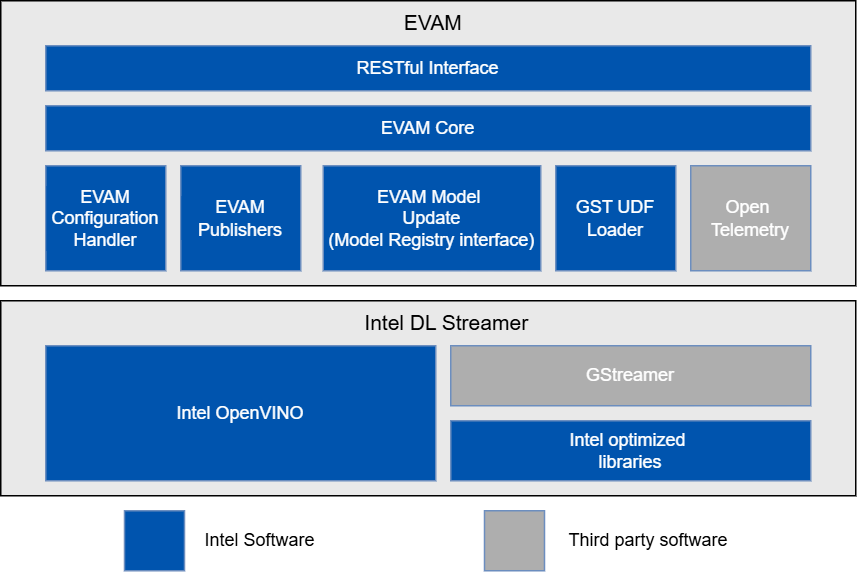

# Overview and Architecture

Edge Video Analytics Microservice is a Python-based, interoperable containerized microservice for easy development and deployment of video analytics pipelines. It is built on top of [GStreamer](https://gstreamer.freedesktop.org/documentation/) and [Intel® Deep Learning Streamer (DL Streamer)](https://dlstreamer.github.io/) , providing video ingestion and deep learning inferencing functionalities.

## Architecture Overview

### High-Level Architecture Diagram
  
*Figure 1: High-level system view demonstrating the microservice.*

## Supporting Resources
* [Get Started Guide](get-started.md)
* [API Reference](api-reference.md)
* [System Requirements](system-requirements.md)