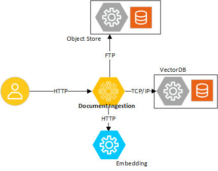

# Data Ingestion microservice

<!--
**User Story US-1: Learning About the Microservice**
- **As a developer**, I want to understand the purpose and benefits of the microservice so that I can determine if it fits my project.

**Acceptance Criteria**:
1. A concise description of the microservice’s purpose.
2. A summary of its technical value and benefits.
-->
## Overview
Data ingestion service loads, parses, and creates embeddings for popular document types like pdf, docx, and txt files. The data ingestion is implemented as a microservice which in trun interacts with other microservices, namely vectorDB, data store, and embedding to achieve the functionality. The ingested documentes are converted to embeddings, embeddings stored in the vectorDB, and source documents stored in the data store. PGVector is used as the vectorDB and minIO is used as the data store.

**Key Benefits**:
<!--
Guidance for Authors:
- Audience Expectation: Developers want to understand why this microservice is worth using and how it will help them meet their goals.
- Highlight the **value proposition** and **outcomes** of the microservice.
- Explain how it helps developers or solves end-user problems.
- Use clear, developer-focused language.
- Example Benefits:
  - Reduces time to market with ready-to-use pipelines.
  - Improves accuracy for real-time data processing.
-->
1. This microservice provides necessary abstraction with 3rd party vectorDB and data store making it easy to integrate other providers.
2. The microservice provides support for handling popular document types. It is also a place holder for necessary extensions to add additional document types.
3. The selected components to implement the functionality is benchmarked and validated for optimal performance.

<!--
**User Story US-2: Understanding Use Cases**
- **As a developer**, I want to learn how this microservice applies to real-world scenarios so that I can evaluate its relevance.

**Acceptance Criteria**:
1. At least two practical use cases demonstrating the microservice in action.
-->
## Example Use Case

- **Use Case 1**: Refer to the [ChatQnA](https://github.com/intel-innersource/applications.ai.intel-gpt.generative-ai-examples/tree/main/reference_apps/intel-egai-chatqna) sample application where this microservice is used.

<!--
Diagram Guidelines:
1. Show the microservice as part of a broader system.
2. Include:
   - Inputs (e.g., sensors, data streams).
   - Processing steps (e.g., signal processing, AI inference).
   - Outputs (e.g., alerts, API responses).
3. Use clear labels and simple flows to make the diagram easy to interpret.
-->
### High-Level System View Diagram

*Figure 1: High-level system view demonstrating the microservice in a real-world use case.*

<!--
**User Story US-3: Discovering Key Features**
- **As a developer**, I want to understand the key features of the microservice so that I can assess its capabilities.

**Acceptance Criteria**:
1. Highlight technical capabilities relevant to developers.
2. List any optimizations or integrations that simplify usage.
-->
## Key Features
<!--
Guidance for Authors:
- Audience Expectation: Developers want to know what the microservice does and how it works at a technical level.
- Focus on the **technical capabilities** of the microservice (what it does).
- Use developer-focused language, such as specific APIs or processing pipelines.
- Example Features:
  - REST and gRPC API support.
  - Modular architecture for extending components.
  - Pre-trained models optimized for specific use cases.
-->
1. The user manages the documents using REST APIs supported by the microservice. The APIs allows the user to upload, delete, and read the documents managed by the microservice.
2. The microservice uses PGVector as the vectorDB. However, implementation is modular to support other vectorDBs.

<!--
**User Story US-4: Supporting Resources**
- **As a developer**, I want access to resources that help me get started with the microservice so that I can begin implementation quickly.

**Acceptance Criteria**:
1. Links to relevant documentation (e.g., API references, tutorials).
2. Easy navigation to developer resources.
-->
## Supporting Resources
- [**Get Started Guide**](./docs/get-started.md)
- [**API Reference**](./docs/dataprep-api.yml)
- [**System Requirements**](./docs/system-requirements.md)
<!-- - **Developer Forum** -->