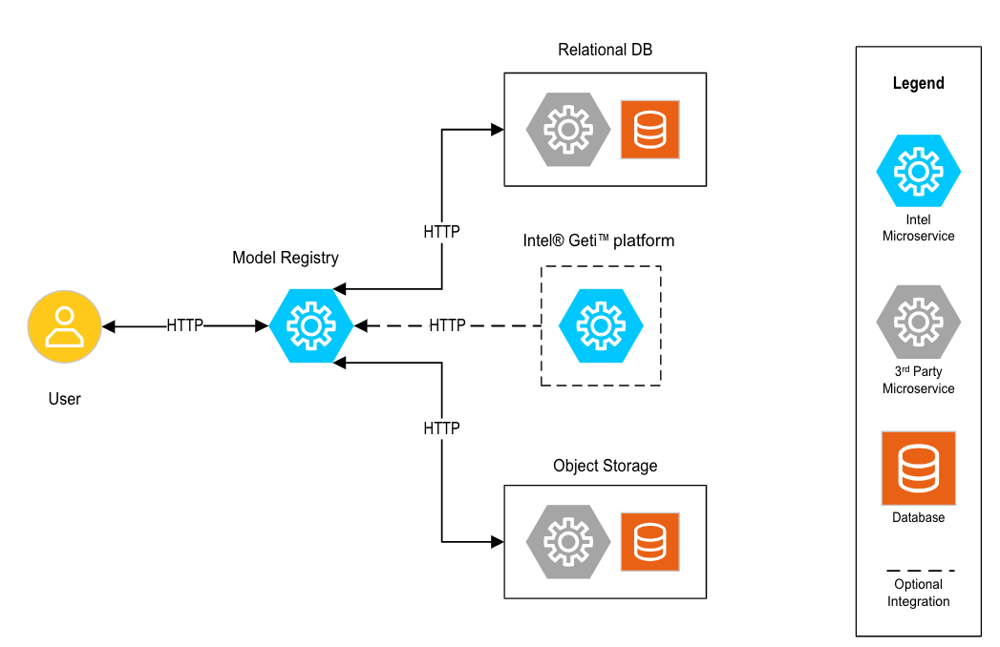

# Model Registry
The Model Registry microservice provides a centralized repository that facilitates the management of AI models.

# Overview
The Model Registry plays a crucial role in the machine learning life cycle, providing a structured storage environment for models and their metadata. It stores each model's details, such as its version, precision, target device, score and more. This allows for easy tracking of each model over time and ensures that each model is always readily available for deployment.

It is particularly useful for developers as it enables effective model management. Developers can use the registry to compare different models and select the most suitable model for deployment. The registry provides transparency as the details of each model are stored and can be easily accessed.

It also promotes collaboration among users. Since the registry is a centralized repository, it can be accessed by different applications, services, or developers enabling them to store, and review models collectively. The model registry is an essential tool for developers deploying machine learning models, as it streamlines model management, fosters collaboration, and ultimately, aids in improving model deployments.

**Key Benefits**
* **Benefit 1**: Keeps track of different versions of models, allowing for easy rollback and comparison between versions.
* **Benefit 2**: Ensures that models can be reproduced by storing all necessary metadata
* **Benefit 3**: Offers integration with other services and platforms to streamline workflows.

**Use Cases**

A model registry microservice can be applied to various real-world use cases and scenarios across different industries. Here are some examples:
* **Use Case 1**: Tracking and updating fraud detection models to adapt to new fraudulent patterns.
* **Use Case 2**: Versioning predictive models for patient diagnosis and treatment recommendations.
* **Use Case 3**: Managing quality control models to ensure product consistency and safety.

# How It Works

The Model Registry microservice works by serving as a centralized repository for models where, their versions, and metadata are stored. The software behind the microservice is designed to handle the storage, versioning, and metadata management of each model. It also provides functionalities for storing, searching and retrieving model artifacts via a RESTful API.

The software fulfills the promise described in the Overview via its various components.

## High-Level System View Diagram
  
*Figure 1: High-level system view demonstrating the microservice.*

**Model Registry**

The Model Registry provides REST API endpoints as the primary interface for interacting with the microservice. These endpoints allow users to perform various operations such as registering new models, updating, retrieving and deleting existing models.

**Relational Database**

The Relational Database is responsible for storing structured data related to the models.

**Object Storage**

The Object Storage solution is used to store unstructured data, such as model binaries and other files.

**Intel® Geti™ Platform**

The Intel® Geti™ platform is accessible via optional configurations within the model registry. Once configured, the model registry is able to access the projects and models hosted within a remote Geti platform. 

## Key Features
* **Feature 1**: Provides a comprehensive set of REST API endpoints for operations such as registering, updating, retrieving, and deleting models.
* **Feature 2**: Utilizes a relational database to store structured data related to models, ensuring data integrity.
* **Feature 3**: Leverages an object storage solution for scalable storage and retrieval of unstructured data, including model binaries and artifacts.
* **Feature 4**: Offers optional configurations to integrate with the Intel® Geti™ platform, enabling access to projects and models hosted on a remote Geti platform.

## Supporting Resources

* [Get Started Guide](get-started.md)
* [API Reference](api-reference.md)
* [System Requirements](system-requirements.md)
