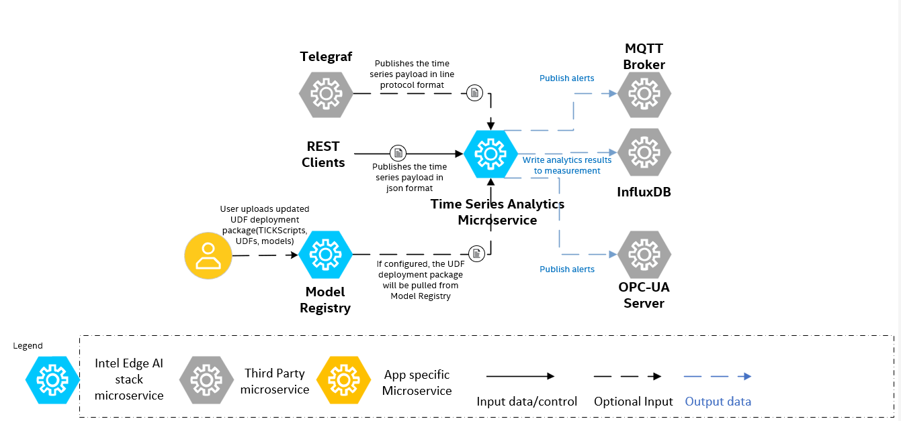

# Time Series Analytics Microservice

The Time Series Analytics microservice is a powerful, flexible solution for real-time analysis of time series data. It supports advanced analytics through User-Defined Functions (UDFs) written in Python. By leveraging the Intel® Extension for Scikit-learn*, you can accelerate machine learning workloads within their UDFs, unlocking high-performance anomaly detection, predictive maintenance, and other sophisticated analytics.

The key features include:

- Use your own data sets and Python-based analytics for custom analysis.
- Automatically save results in InfluxDB for easy management and visualization.
- Quickly access and deploy scripts and models from the Model Registry.
- Detect anomalies, send alerts, and advanced analytics in various settings.

## Get Started

To see the system requirements and other installation, see the following guides:

- [System Requirements](docs/user-guide/system-requirements.md): Hardware and software requirements for running the microservice.
- [Get Started](docs/user-guide/get-started.md): Step-by-step guide to getting started with the docker compose deployment of the microservice.


## How It Works

The `Time Series Analytics` microservice can take input data from Input payload and configuration management via REST APIs and UDF deployment package. The high-level architecture diagram is as follows:



The default flow consists of using a temperature simulator to generate data in JSON format, which is then analyzed by a custom function within a time series analytics service to identify and log any temperature anomalies.

For more details on Architecture, see [Architecture](docs/user-guide/high-level-arch.md).

## Learn More

  - [Overview](docs/user-guide/Overview.md): A high-level introduction to the Time Series Analytics Microservice.
  - [Docker compose deployment](docs/user-guide/get-started.md): Instructions for building the microservice from source code.
  - [Helm deployment](./docs/user-guide/how-to-deploy-with-helm.md): Instructions for advanced configuration.
  - [API reference](./docs/user-guide/how-to-access-api.md): Instructions to exercise REST APIs
  - [Release Notes](docs/user-guide/release_notes/Overview.md): Information on the latest updates, improvements, and bug fixes.

## Run Unit tests

Follow the steps to run the unit tests.

```bash
git clone https://github.com/open-edge-platform/edge-ai-libraries
cd edge-ai-libraries/microservices/time-series-analytics
echo "Running unit tests"
./tests/run_tests.sh
```

## Run Functional tests

Follow the steps to run the functional tests.
```bash
git clone https://github.com/open-edge-platform/edge-ai-libraries
cd edge-ai-libraries/microservices/time-series-analytics/tests-functional
echo "Running functional tests"
pip3 install -r requirements.txt
pytest -q -vv --self-contained-html --html=./test_report/report.html .
```