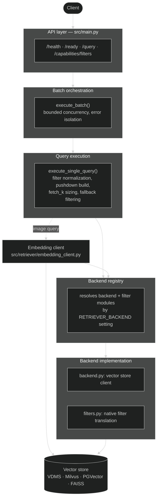
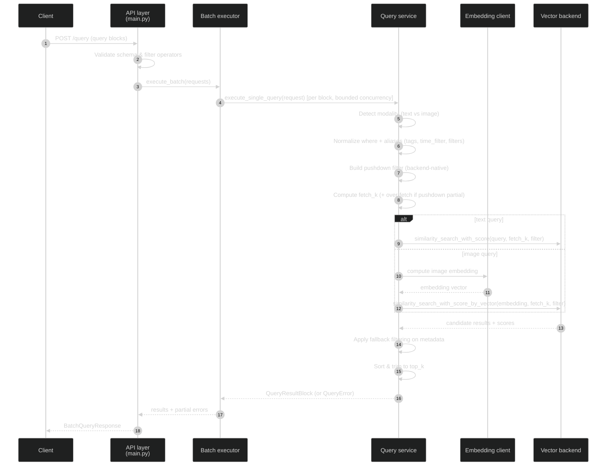

# How It Works

The retriever service translates user queries into vector similarity searches and returns ranked metadata-rich results. It separates backend-independent orchestration from backend-specific vector store implementations.

## Architecture Summary

### Core layers

- API layer (`src/main.py`): validates requests, exposes `/health`, `/ready`, `/query`, and `/capabilities/filters`
- Batch orchestration (`src/retriever/batch_executor.py`): executes query list with error isolation
- Query execution (`src/retriever/service.py`): normalizes filters, builds backend-native pushdown filters, calls the selected vector backend, and applies fallback filtering
- Backend registry (`src/retriever/backends/registry.py`): resolves backend modules and filter translators dynamically
- Backend implementation (`src/retriever/backends/<name>/backend.py`): creates backend vector store client
- Backend filter translation (`src/retriever/backends/<name>/filters.py`): translates query filters into backend-native syntax

### Request flow

1. Client sends `POST /query` with a list of query blocks.
2. Service validates schema and filter operators.
3. Service detects query modality: text (`query`) or image (`image`).
4. Service normalizes the primary `where` contract plus compatibility aliases (`tags`, `time_filter`, `filters`).
5. Backend-specific pushdown filters are built from the safe subset of predicates.
6. Service computes candidate retrieval size (`fetch_k`), including over-fetch when pushdown is partial or absent.
7. For text queries, the selected vector store executes similarity search with score. For image queries, the service computes the image embedding via the embedding API and performs vector search by embedding.
8. Service applies fallback filtering against returned metadata for consistency across backends.
9. Results are sorted and returned as `BatchQueryResponse` with partial errors when needed.

### Pushdown and fallback model

- Pushdown stage: backend-native filter payload is built from pushdown-safe predicates.
- Fallback stage: full normalized `where` tree is evaluated in service code on retrieved candidates.

Fallback evaluation is authoritative for final inclusion. Over-fetch is used to increase the
candidate pool before fallback when the service detects that backend pushdown may be incomplete.

## Why registry with backend folders

The backend registry lets the service support multiple vector stores without backend conditionals spread across business logic. Each backend owns:

- connection/client setup
- readiness behavior
- filter translation semantics

This keeps onboarding of new backends localized and predictable.

## Supported backend filter styles

- **VDMS**: list-based filter expressions
- **Milvus**: SQL-like `expr` string
- **PGVector**: Mongo-style filter document
- **FAISS**: dict-style metadata filters (Mongo-like operators)

## Supporting Resources

- [Overview](./index.md)
- [System Requirements](./get-started/system-requirements.md)
- [Get Started](./get-started.md)
- [How to Build from Source](./get-started/build-from-source.md)
- [How To Add New Retriever Backend](./add-new-retriever-backend.md)
- [API Reference](./api-reference.md)
- [Download OpenAPI Specification](./api-docs/openapi.yaml)
- [Release Notes](./release-notes.md)
