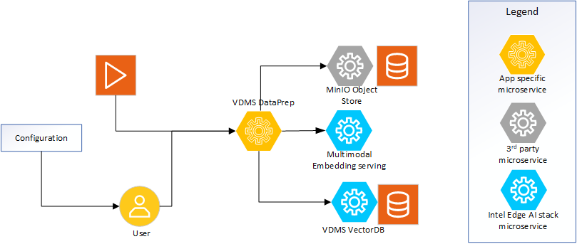

# Overview and Architecture

Multimodal DataPrep turns raw media — **videos and images** — plus associated
text summaries into searchable embeddings that conform to the requirements of the
VSS Search microservice. The architecture is intentionally modular so that each
stage can scale independently or be swapped out without changing the API surface.
The service is **vector-database agnostic** and **storage agnostic**: the vector
store and the object storage are each selected at startup behind a factory (see
[Pluggable Backends](pluggable-backends.md)).

## Architecture Overview

### High-Level Architecture Diagram

*Figure 1: High-level system view demonstrating the microservice.*

### Core Components

- **Multimodal DataPrep (this service)** – A FastAPI application mounted at `/v1/dataprep`. It orchestrates media intake, frame extraction (video), object detection, in-process embedding generation, manifest storage, and metadata management.
- **Multimodal Embedding package** – The local package dependency (`multimodal-embedding-serving`) is imported directly so CLIP-style models are loaded in-process by DataPrep and used to embed both video frames and images.
- **Vector database (pluggable)** – The central vector store persists frame, image, crop, and summary embeddings along with metadata (`video_url`, tags, timestamps, and a `content_type` of `video` / `image` / `text`). Backend is chosen with `MM_DATAPREP_VECTORDB_BACKEND` (`vdms` default, or `milvus`) via LangChain integrations. The collection name defaults to `video-rag-test` and can be overridden via `MM_DATAPREP_DB_COLLECTION`.
- **Object storage (pluggable)** – Persistent storage for the raw media assets and temporary caches. Backend is chosen with `MM_DATAPREP_STORAGE_BACKEND` (`minio` default, or `local` filesystem). Buckets are validated/created on demand through the storage factory.

### Inputs

- **Direct media uploads** through `POST /v1/dataprep/media/upload` — a multipart binary upload of a video (MP4) **or** an image (JPG/PNG/WEBP/BMP/GIF). The service streams the bytes into storage and keeps them in memory for processing.
- **Image JSON ingestion** through `POST /v1/dataprep/media/ingest` — a typed JSON body that carries an image as inline **base64** (`type=image_base64`) or a remote **URL** (`type=image_url`) that the service downloads. This mirrors the multimodal-embedding-serving typed-input discriminator.
- **Stored-media references** through `POST /v1/dataprep/media/process` for content already present in object storage. The request only needs the bucket name and directory (`video_id`).
- **Batch ingestion** through the async job engine: `POST /media/upload/batch` (many files), `POST /media/ingest/batch` (many JSON image sources), `POST /media/process/batch` (many already-stored items), and `POST /media/ingest-dir` (a mounted directory). Each returns `202 Accepted` with a `job_id` polled at `GET /media/jobs/{job_id}`.
- **Text summaries** through `POST /v1/dataprep/summary`. These requests reference an existing video and enrich it with timestamp-aligned text metadata and tags.
- **RTSP streams** through `POST /v1/dataprep/media/rtsp` (video only).

### Processing Pipeline

1. **Request validation & sanitation** – All payloads are validated using the Pydantic models in `src/common/schema.py`. Optional request overrides (`frame_interval`, `enable_object_detection`, `detection_confidence`, `tags`) are normalized at this stage. For base64/URL images, the decoded bytes are the trust boundary: the real format is sniffed to derive the stored extension (client-declared type is never trusted) and size is capped.
2. **Deduplication (optional)** – When `MM_DATAPREP_ALLOW_DUPLICATE_UPLOADS=false`, a content SHA-256 is computed and matched against a per-bucket hash marker; identical content is rejected with `409 Conflict`.
3. **Media-kind dispatch** – The media type is detected from the file. **Videos** go through frame extraction; **images** skip extraction and are embedded directly.
   - **Video – frame extraction:** `src/core/utils/video_utils.py` reads the video via decord, sampling every Nth frame and saving crops when object detection is enabled.
   - **Image – direct embed:** the whole image is embedded once (`frame_type=full_frame`); when object detection is enabled, each detected crop is embedded separately — mirroring the per-frame crop contract used for video.
4. **Object detection** – YOLOX models are loaded once per worker and reused. Detection can be toggled per request or globally via `MM_DATAPREP_ENABLE_OBJECT_DETECTION`, and applies to both video frames and images.
5. **Embedding generation** – The service runs the in-process embedding pipeline, fans out work across multiple threads (`MM_DATAPREP_MAX_PARALLEL_WORKERS`), and stores embeddings in bulk. All embeddings are stamped with download URLs, timestamps, `content_type`, and detector metadata.
6. **Metadata persistence** – `metadata_utils` writes manifests and per-record metadata, then hands them to the embedding client (`EmbeddingClient`) for storage via the selected vector-store backend.

### Outputs

- **Embeddings & metadata** persisted in the vector database with references back to the originating media (`video_id`, `video_name`), frame numbers (video), crop details, `content_type`, and optional tags.
- **Raw media** stored under `{video_id}/{filename}` with download links exposed via `GET /v1/dataprep/media/download` (HTTP Range/seek supported).
- **Operational responses** that report the number of embeddings stored and success/error status for clients. Batch surfaces additionally report per-item results.

## Supporting Resources

- [Get Started Guide](get-started.md)
- [Pluggable Backends](pluggable-backends.md) - Vector-database and storage backend selection
- [Media Ingestion Flow](./media-ingestion-flow.md) - Detailed flow diagrams of the video and image processing pipelines
- [API Reference](api-reference.md)
- [System Requirements](system-requirements.md)
