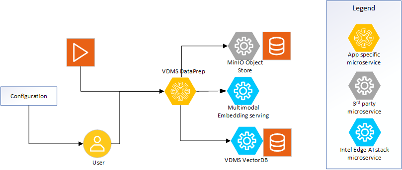

# Overview and Architecture

The VDMS Data preparation microservice provides capability to create embeddings from input video, image, or text data. The primary usage here is mainly video in the context of video applications and will be the main focus.

## Architecture Overview

### High-Level Architecture Diagram
  
*Figure 1: High-level system view demonstrating the microservice.*

### Inputs
* **Video file**: Provides reference to the video file to be used as input. The file will be ingested from file system.
* **API Requests**: REST API calls for supported operations.

### Processing Pipeline
* **VDMS DataPrep**: The VDMS based Data Preparation microservice implements the REST API that is required to ingest videos. Using the multimodal embedding serving microservice, it creates the embeddings which is stored in VDMS vectorDB while the raw video is stored to MinIO object store for future reference.
* **VDMS VectorDB**: This provides all the VectorDB handling requirements. Refer to [Intel VDMS Vector DB](https://github.com/IntelLabs/vdms) for further details.
* **MinIO object store**: The standard [MinIO object store microservice](https://hub.docker.com/r/minio/minio) is used as is here.
* **MinIO object store**: Refer to [Multimodal Embedding serving](../../../../multimodal-embedding-serving/) for details of this microservice.

### Outputs
* **Embeddings**: The created embeddings are stored to the VDMS vectorDB which is used in video analytics pipelines.
* **Raw Video**: The raw video files are stored in the minIO object store.
* **API Responses**: Provides feedback on operations, including success or error messages, and returns output for the requested API call.

## Supporting Resources
* [Get Started Guide](get-started.md)
* [API Reference](api-reference.md)
* [System Requirements](system-requirements.md)
