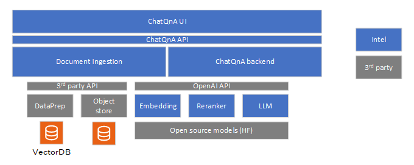

# ChatQ&A Sample Application

ChatQ&A sample application is a foundational Retrieval-Augmented Generation (RAG) pipeline that allows users to ask questions and receive answers, including those based on their own private data corpus. The sample application demonstrates how to build a RAG pipeline using Intel's Edge AI microservices catalog and deploy it optimally on Intel's Edge AI systems. This sample application simplifies the development, customization, and deployment of chat applications in diverse deployment scenarios with out-of-the-box support for on-prem and edge environments.

## Table of Contents

1. [Overview and Architecture](#overview-and-architecture)
2. [How to Use the Application](#how-to-use-the-application)

## Overview and Architecture

### Key Features

Key features include:

- **Optimized RAG pipeline on Intel Edge AI Systems hardware**: The application is [optimized](./benchmarks.md) to run efficiently on Intel® Edge AI systems hardware, ensuring high performance and reliability.
- **Customizable RAG pipeline with optimized microservices**: Intel's Edge AI [inference microservices](../../../../microservices/) allow developers to customize and adapt specific parts of the application to suit their deployment and usage needs. For example, developers can customize the data ingestion process for specific document types without altering the rest of the RAG pipeline. Intel's inference microservices provide the flexibility to tailor the application for specific deployment scenarios and usage requirements without compromising performance on the given deployment hardware.
- **Flexible deployment options**: The application provides options for deployment using Docker Compose and Helm charts, enabling developers to choose the best deployment environment for their needs.
- **Support for a wide range of open-source models**: Intel's inference microservices provide flexibility to use the right GenAI models (LLM, for example) as required for target usage. The application supports various [open-source models](https://huggingface.co/OpenVINO), allowing developers to select the best models for their use cases.
- **Self-hosting inference**: Perform inference locally or on-premises, ensuring data privacy and reducing latency.
- **Observability and monitoring**: The application provides observability and monitoring capabilities using [OpenTelemetry](https://opentelemetry.io/) & [OpenLIT](https://github.com/openlit/openlit), enabling developers to monitor the application's performance and health in real-time.

### Technical Architecture

The ChatQ&A sample application includes the following components:

- **LLM inference microservice**: Intel's optimized [OpenVINO Model Server (OVMS)](https://github.com/openvinotoolkit/model_server) is used to efficiently run large language models on Intel hardware. Developers also have other model serving options if required. vLLM with OpenVINO backend and TGI are the options provided.
- **Embedding inference microservice**: Intel's optimized [OpenVINO Model Server (OVMS)](https://github.com/openvinotoolkit/model_server) and Huggingface [Text Embeddings Inference](https://github.com/huggingface/text-embeddings-inference) microservice are the options provided to run embedding models efficiently on target Intel hardware. OVMS is the default option due to performance benefits on Intel hardware.
- **Reranking inference microservice**: Huggingface [Text Embeddings Inference](https://github.com/huggingface/text-embeddings-inference) microservice is the model serving choice available.
- **Document ingestion microservice**: The sample [document ingestion](../../../../microservices/document-ingestion/) microservice allows ingestion of common document formats like PDF and DOC, and contents from web links. It supports a REST endpoint to ingest the documents. The ingestion process creates embeddings of the documents and stores them in the preferred vector database. The modular architecture allows users to customize the vector database. The sample application uses [PGvector](https://github.com/pgvector/pgvector) database. The raw documents are stored in the [MinIO](https://github.com/minio/minio) datastore, which is also customizable.
- **ChatQ&A backend microservice**: The Chat&A backend microservice is responsible for responding to the user queries. LangChain framework is used to create the RAG chain and provide the necessary integrations with VectorDB. The backend microservice provides a REST API to accept user queries.
- **ChatQ&A UI**: A reference UI is provided to enable users quickly try the sample-application. The  UI is not designed to be a comprehensive guide on the design of UI but is more a functional implementation to enable quick demo interaction. It allows users to create the context by uploading the documents and provide weblinks. Users can then interact with the RAG pipeline. It uses the REST API provided by the document ingestion and ChatQ&A backend for its operations.

All the 3rd party components are not built from source but instead the respective pre-built images are pulled from their artefactory (Docker hub for example) and used. The model serving is also reused from their prebuilt versions and used for LLM, Embedding, and Reranker. The Intel microservices can be built from source. Documentation is provided to help users build these microservices from source. 

Further details on the system architecture and customizable options are available [here](./overview-architecture.md).

## How to Use the Application

Refer to the [Get Started](./get-started.md) page to get started with the sample-application. The UI is the recommended mode of interaction with the sample-application though users can also use the CLI approach using the REST endpoints. The ChatQ&A sample application consists of two main parts:

1. **Data Ingestion [Knowledge Building]**: This part is responsible for adding documents to the ChatQ&A instance. The document ingestion microservice allows creation of this knowledge base.

2. **Generation [Q&A]**: This part allows the user to query the document database and generate responses. The LLM inference microservice, embedding inference microservice, and reranking microservice work together to provide accurate and efficient answers to user queries. When a user submits a question, the embedding model hosted by the chosen model serving (default is OVMS) transforms it into an embedding, enabling semantic comparison with stored document embeddings. The vector database searches for relevant embeddings, returning a ranked list of documents based on semantic similarity. The LLM Inference Microservice generates a context-aware response from the final set of documents. It is possible to use any supported models to run with the applications. Detailed documentation provides full information on validated models and models supported overall.

Detailed hardware and software requirements are available [here](./system-requirements.md).

[This sample application is ready for deployment with Edge Orchestrator. Download the deployment package and follow the instructions](deploy-with-edge-orchestrator.md)

## Benchmark Results

Detailed metrics and analysis can be found in the benchmark report [here](./benchmarks.md).

<!--
## Support and Community

This section provides information on how to get support and engage with the community.
-->
