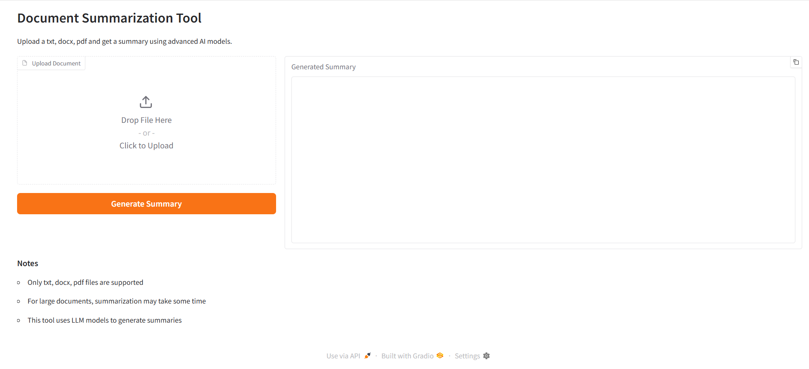

# Document Summarization Sample Application

Document Summarization Sample Application is a cutting-edge solution designed to efficiently generate concise summaries from extensive documents.
This application leverages the power of LlamaIndex Document Summary Index, integrated with a microservices architecture that utilizes
advanced language models (LLMs) to deliver high-quality summaries.

# Key Features
- **Efficient Summarization**: Quickly generate summaries from large volumes of text, saving time and enhancing productivity.
- **Scalable Microservices Architecture**: Designed to handle varying workloads, ensuring consistent performance and reliability.
- **Advanced Language Model Integration**: Utilizes state-of-the-art LLMs to produce accurate and contextually relevant summaries.

# Advantages of Using LlamaIndex Document Summary Index
- **Enhanced Accuracy and Relevance**: LlamaIndex Document Summary Index can produce summaries that are
   concise, accurate, and relevant. By focusing on key information and context, it ensures that the generated summaries
   retain the essence of the original document.
- **Speed and Efficiency**: The LlamaIndex framework is optimized for speed, allowing the application to process and summarize documents rapidly.
   This efficiency is crucial for users who need quick access to summarized information without compromising on quality.
- **Scalability**: LlamaIndex framework is designed to scale seamlessly, making it ideal for applications that need to handle large volumes of data.
   Whether you are summarizing a single document or thousands, LlamaIndex framework ensures consistent performance.
- **Integration with Advanced LLMs**: Our application's microservices architecture integrates LlamaIndex framework with advanced language models,
  enhancing its ability to understand and summarize complex documents. This integration allows for more nuanced and sophisticated summaries,
  catering to diverse user needs.
- **Customization and Flexibility**: LlamaIndex framework offers flexibility in summary generation, allowing users to customize the level of detail
  and focus according to their specific requirements. This adaptability makes it suitable for a wide range of applications and industries.

  # Technical Architecture:
  The Document Summarization Sample Application includes the following components:

- **LLM inference microservice**: Intel's optimized [OpenVINO™ Model Server](https://github.com/openvinotoolkit/model_server) runs LLMs on Intel® hardware efficiently. Developers have other model serving options if required.
- **Document Summary API Service**: A FastAPI service that exposes the API to summarize the uploaded document. The service ingests each document and uses a LLM to generate the summary. It splits the file into text chunks (nodes). The summary and nodes are stored within the Document Store abstraction. The application maintains the mapping from the summary to the source document.
- **Document Summary UI Service**: A Gradio UI that enables you to upload a file and generate a summary with the summary API. The application supports the txt, docs, and pdf formats currently.
