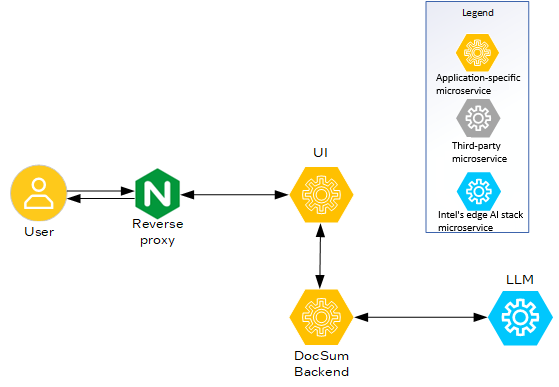
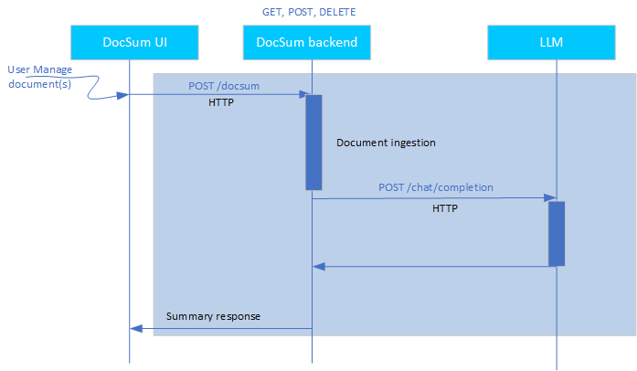

# System Design Document: Document Summarization Application

## Overview

The Document Summarization Sample Application provides an end-to-end pipeline for summarizing documents using advanced AI models. It exposes a REST API and a user-friendly web UI, leveraging containerized microservices for scalability and maintainability.

## Architecture Diagram
The following figure shows the microservices required to implement the Document Summarization Sample Application.

## Components

### 1. NGINX Web Server-based Reverse Proxy
- **Role:** Routes external requests to the appropriate backend service (API or UI).
- **Configuration:** `nginx.conf`
- **Port:** `8101` (external)

### 2. Gradio UI-based UI (`docsum-ui`)
- **Role:** Provides a web interface for users to upload documents and view summaries.
- **Implementation:** `ui/gradio_app.py`
- **Port:** `9998` (external, mapped to `7860` in container)
- **Depends on:** `docsum-api`

### 3. DocSum Backend Platform (`docsum-api`)
- **Role:** Handles REST API requests for document summarization and file uploads; and orchestrates the summarization pipeline.
- **Implementation:** `app/server.py`
- **Port:** `8090` (external, mapped to 8000 in container)
- **Depends on:** OVMS Model Server (for LLM inference)

### 4. LLM on OpenVINO™ Model Server (`ovms-service`)
- **Role:** Serves AI models (e.g., LLMs) for inference.
- **Configuration:** Loads models from a mounted volume.
- **Ports:** `9300` (gRPC), `8300` (REST)

## Data Flow

1. **User uploads a document** through the UI.
2. **UI sends the document** to the DocSum backend platform (`docsum-api`) through REST API.
3. **Backend processes the document** (e.g., chunking and pre-processing).
4. **Backend sends inference requests** to the OpenVINO™ model server for summarization.
5. **Summary is returned** to the backend platform, which then sends it to the UI for display.

The following figure shows the data flow:

## Deployment

- All services are containerized and orchestrated through `docker-compose.yaml`.
- Services communicate over a shared Docker bridge network (`my_network`).
- Environment variables are used for configuration and proxy settings.

## Key Files

- `docker-compose.yaml`: Service orchestration.
- `app/server.py`: FastAPI backend.
- `ui/gradio_app.py`: Gradio UI.
- `nginx.conf`: NGINX web server configuration.

## Extensibility

- **Model Flexibility:** OpenVINO™ model server can serve different models by updating the model volume and configuration.
- **UI Customization:** Gradio UI provides rich set of capabilities to customize the UI as per user preferences.
- **API Expansion:** You can extend the FastAPI backend for more endpoints or pre and post-processing logic.

## Security and Observability
- **Security:** You can configure the NGINX web server for SSL and TLS authentication.
- **Logging:** Each service logs to stdout and stderr for Docker log aggregation.
- **Healthchecks:** OpenVINO™ model server and API services have healthchecks defined in Docker Compose tool.

## References

- README.md
- config.py (for environment/config management)
