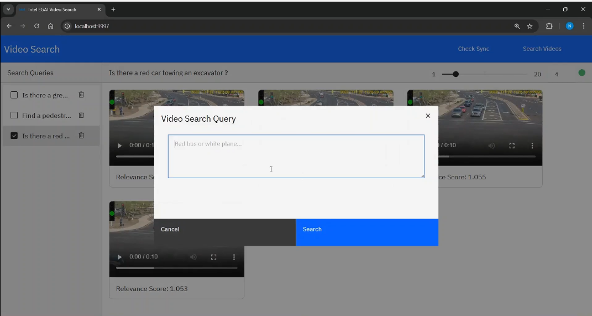
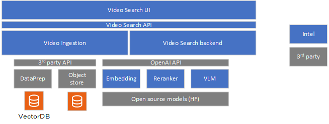

# Video Search Overview

Video Search using multimodal embedding models leverages generative AI for enabling natural language querying of video content. By combining contextual and perceptual understanding, Video Search can interpret and respond to user queries with high accuracy. The system now incorporates agentic reasoning, allowing it to decompose and process complex queries, generate and track events, and orchestrate multi-step retrievals across video corpora. This enables users to search for specific information or patterns within a video collection, including private video archives, using natural language—even for open-ended or multi-part queries. The technology can execute these queries in the background, raising events or notifications when a successful match is found. By integrating visual, audio, and textual data, and supporting agentic reasoning, the application delivers a more intuitive, powerful, and efficient video search experience suitable for use cases such as video forensics, media analysis, content management, and personalized recommendations.

Video Search is a foundational retrieval-augmented generation (RAG) pipeline for video data that allows for natural-language based interaction on a given video corpus. The application demonstrates that a rich experience can be built using a cost-efficient portfolio of Intel® AI systems and using Intel's edge AI microservices catalog. The Video Search pipeline simplifies the development, customization, and deployment of Video Search applications in diverse deployment scenarios with out-of-the-box support for on-premises and edge environments.

## Key Features

Key features include:

- **Rich Video Search pipeline**: The application provides a host of capabilities that can be used to influence the response given to an user query, qualitatively. The capabilities help with richer contextual and perceptual understanding of the video. Example: Combining the audio and visual contents of the video for richer context. 

- **Natural Language Querying**: The application enables users to search for or query video content using natural-language queries, making the search process intuitive and user-friendly.

- **Optimized pipeline on Intel Edge® AI Systems hardware**: The application is optimized to run efficiently on Intel Edge AI systems, ensuring high performance, reliability, and cost of ownership. Refer to [system requirements](./system-requirements.md) for the list of hardware on which the pipeline is validated and optimized.

- **Customizable pipeline with optimized microservices**: The application allows for customization of various components of the pipeline, such as video ingestion, model selection, and deployment options to suit specific use cases and deployment scenarios. Intel's edge AI inference microservices allow developers to customize and adapt specific parts of the application to suit their deployment and usage needs. Intel's inference microservices provide the flexibility to tailor the application for specific deployment scenarios and usage requirements without compromising performance on the given deployment hardware.

- **Flexible deployment options**: The application provides options for deployment using Docker\* Compose tool and Helm\* charts, enabling developers to choose the best deployment environment for their needs.

- **Support for a wide range of open-source models**: Intel's inference microservices provide flexibility to use the right generative AI models (for example, VLM and embeddings) as required for the target usage. The application supports various [open-source models](https://huggingface.co/OpenVINO), allowing developers to select the best models for their use cases.

- **Self-hosting inference**: Perform inference locally or on-premises, ensuring data privacy and reducing latency.

- **Observability and monitoring**: The application provides observability and monitoring capabilities using [OpenTelemetry\* APIs, SDKs, and tools](https://opentelemetry.io/) & [OpenLIT platform](https://github.com/openlit/openlit), enabling developers to monitor the application's performance and health in real-time.

- **User-Friendly Interface**: The application provides a reference intuitive and easy-to-use interface for users to interact with the Video Search application.

- **Agentic Reasoning and Event Generation**: The application incorporates agentic reasoning to handle complex, multi-step, or open-ended queries. It can decompose user queries, plan and execute multi-stage retrievals, and generate or track events based on query results. The system is capable of running these queries in the background and raising notifications or events when a successful match is found, enabling proactive and context-aware video analytics.

## High level Architecture
The Video Search sample application includes the following components:

- **Video Search UI**: Users can use the reference UI to interact with and use capabilities of the Video Search sample application. Queries are raised using the interface. Those queries that need to function in the background not just on current video corpus but all incoming videos can be marked as such in the UI. 

- **Video ingestion microservice**: The sample video ingestion microservice allows ingestion of video from the object store. The ingestion process creates embeddings of the videos and stores them in the preferred vector database. The modular architecture allows users to customize the vector database. The sample application uses [Visual Data Management System (VDMS)](https://github.com/IntelLabs/vdms) database. The raw videos are stored in the MinIO\* object store, which is also customizable.

- **Video Search backend microservice**: The Video Search backend microservice handles the queries from the users. The backend microservice is responsible for embedding search; and generates the response using the VLM inference microservice.

- **VLM inference microservice**: Intel's optimized [OpenVINO™ model server](https://github.com/openvinotoolkit/model_server) efficiently runs vision language models on Intel® harware. Developers have other model-serving options, too, if required.

- **Embedding inference microservice**: The OpenVINO™ model server runs embedding models efficiently on the target Intel hardware.

- **Reranking inference microservice**: Though an option, the reranker is currently not used in the pipeline. OpenVINO™ model server runs the reranker models.

See details on the system architecture and customizable options [here](./overview-architecture-search.md).

## How to Use the Application

The Video Search pipeline consists of two main functionalities:

- **Video Ingestion (Knowledge Building)**: This part is responsible for adding videos to the application instance. The video ingestion microservice allows ingestion of common video formats. The ingestion process creates the embeddings of the videos using the embedding microservice, and stores them in the preferred vector database. The modular architecture allows users to customize the vector database. 

- **Generation (Search results)**: This part allows the user to query the video database and generate responses. The VLM inference microservice, embedding inference microservice, and reranking microservice work together to provide accurate and efficient answers to user queries. When a user submits a question, the embedding model transforms it into an embedding, enabling semantic comparison with stored document embeddings. The vector database searches for relevant embeddings, returning a ranked list of documents based on semantic similarity. The VLM inference microservice generates a context-aware response from the final set of ranked videos.

To use the application:

1. Upload the videos using the ingestion block or the ingestion APIs exposed by the application.

1. Query the video for specific events using natural language. The application returns a set of videos that match the query.

For detailed hardware and software requirements, see [System Requirements](./system-requirements.md).

To get started with the application, see the [Get Started](./get-started.md) page.

