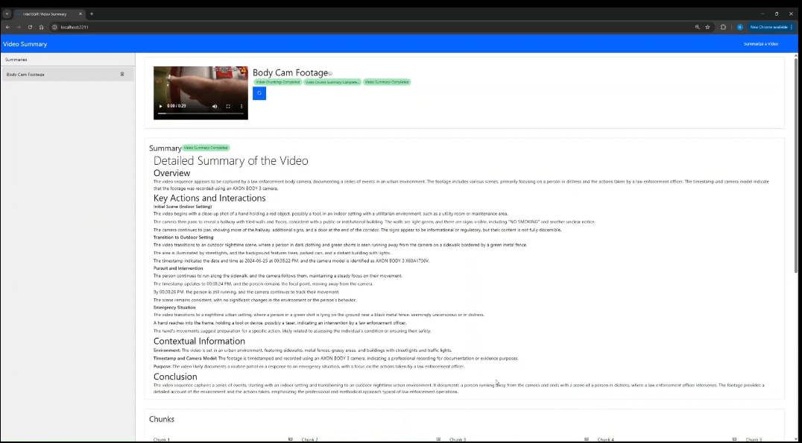
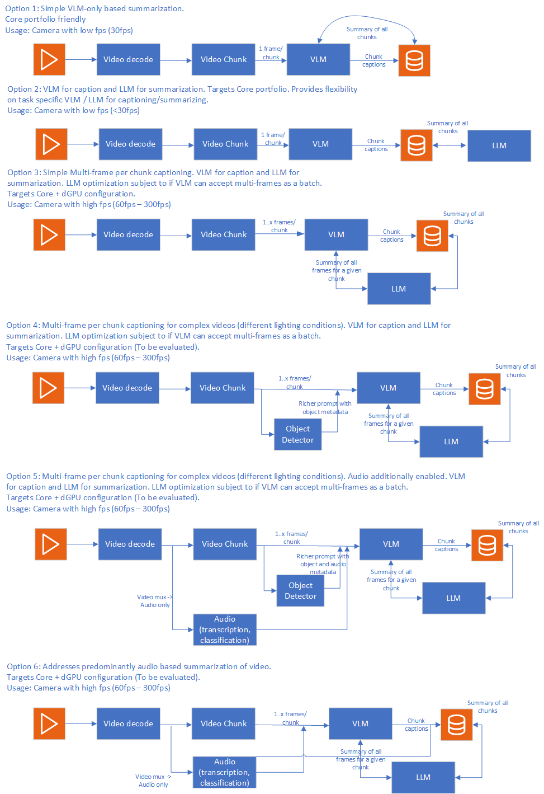

# Video Summary Overview

Video Summary pipeline creates concise and informative summaries of long-form videos. It uses Generative AI Vision Language Models (VLMs), which leverages advanced AI techniques to combine visual, audio, and textual data to understand and extract relevant content from videos, thereby, enabling efficient content review and improved searchability. 

Video Summary provides a rich pipeline with a host of capabilities aiding qualitatively rich response. The application demonstrates how to create a great experience using a cost efficient portfolio of Intel AI systems and using Intel's Edge AI microservices catalog. It makes it easy to develop, customize, and deploy Video Summary solutions in diverse deployment scenarios with out-of-the-box support for on-premise and edge environments.

## Table of Contents
1. [Purpose](#purpose)
2. [How to Use the Application](#how-to-use-the-application-effectively)

## Purpose

This implementation of Video Summary pipeline is intended to address a broad set of industry segment specific requirements on video summarization targeting required accuracy - performance tradeoff. The implementation will be a composable pipeline of capabilities that help with video summarization accuracy while providing an insight into required compute for the chosen pipeline configuration. In essence, what the implementation provides is a means to realize different video summarization pipelines at certain performance and accuracy tradeoff. The figure below shows an example set of pipeline configurations corresponding to different compute requirements.

*Figure 1: Sample video summarization pipeline configurations

Each of the pipelines shown in the figure (and more) can be realized with this sample application. The purpose of this sample application is to enable users create a video summarization pipeline with the best possible accuracy for given compute. To enable this, the sample application follows the listed approach:
- Demonstrates how Intel Edge AI catalog of inference microservices can be used to quickly build video summarization pipelines. The inference microservices are optimized for Intel Edge AI systems. 
- Serve as a blueprint for building similar scalable and modular solutions that can be deployed on Intel Edge AI systems.
- Showcase the competitiveness of Intel Edge AI systems to address varied deployment scenario requirements (edge to cloud).
- Provide reference sample microservices for capabilities like video ingestion and UI front end that reduces the effort to customize the application.

### Key Features

Leveraging GenAI VLMs, LLMs, object detection, and a host of other configurable capabilities, the video summary application is a powerful tool to quickly grasp the main points of long-form videos, enhancing productivity and user experience. The key capabilities are as follows:

- **Efficient Summarization**: Automatically generate detailed summaries of lengthy videos, highlighting key moments and essential information.
- **Enhanced Searchability**: Improve the ability to search within videos by providing summarized content that can be indexed and queried.
- **Contextual Understanding**: Utilize VLMs to combine audio and visual elements, ensuring a richer and more accurate understanding of the video content.
- **Content Review**: Facilitate quicker and more efficient content review processes by providing concise summaries that capture the essence of the video.
- **Customizable Summarization**: Allow customization of capabilities and parameters to suit specific use cases and preferences, such as focusing on particular topics or themes within the video or enabling context extraction from audio. The capabilities on the pipeline are configurable to suit the target application.
- **Scalability**: Handle large volumes of video data, making it suitable for various applications, including media analysis, content management, and personalized recommendations.

The Video Summary sample application provides the above listed capabilities through following features:

- **Rich Video Summary pipeline**: The application provides a host of capabilities that can be used to qualitatively influence the summary of the given user video. The capabilities help with richer contextual and perceptual understanding of the video. Example: Using an object detector to enrich the quality of prompt given as input to VLM captioning. Further details of configurability is provided in the [architecture overview](./overview-architecture-summary.md) document.
- **Optimized pipeline on Intel Edge AI Systems hardware**: The application is optimized to run efficiently on Intel® Edge AI systems, ensuring high performance and reliability.
- **Customizable pipeline with optimized microservices**: The application allows for customization of various components of the pipeline, such as video ingestion, model selection, selection of capabilities enabled on the pipeline, and deployment options to suit specific use cases and deployment scenarios. Intel's Edge AI inference microservices allow developers to customize and adapt specific parts of the application to suit their deployment and usage needs. For example, developers can customize the VLM model with different levels of guardrail capabilities based on segment specific needs. Intel's inference microservices provide the flexibility to tailor the application for specific deployment scenarios and usage requirements without compromising performance on the given deployment hardware.
- **Flexible deployment options**: The application provides options for deployment using Docker Compose and Helm charts, enabling developers to choose the best deployment environment for their needs.
- **Support for a wide range of open-source models**: Intel's Edge AI inference microservices provide flexibility to use the right GenAI models (VLM, Embeddings for example) as required for target usage. The application supports various [open-source models](https://huggingface.co/OpenVINO), allowing developers to select the best models for their use cases.
- **Optimized for Performance**: The default configuration of the pipeline is optimized to run efficiently on target hardware, providing high performance and low cost of ownership.
- **Self-hosting inference**: Perform inference locally or on-premises, ensuring data privacy and reducing latency.
- **Observability and monitoring**: The application provides observability and monitoring capabilities using [OpenTelemetry](https://opentelemetry.io/) & [OpenLIT](https://github.com/openlit/openlit), enabling developers to monitor the application's performance and health in real-time.
- **User-Friendly Interface**: A reference intuitive and easy-to-use interface is provided for users to interact with the Video Summary application.
- **Future extensions**: A sample set of "in-the-works" capabilities are listed below. These are designed as modular capabilities which can be used (or not) specific to deployment requirements.
    - **Natural Language Querying**: The captions generated by the application enable users to search or query video content using natural language queries, making the search process intuitive and user-friendly. This capability allows to combine the video summary pipeline with Video search pipeline.
    - **Audio capability**: For certain videos, the audio provides richer context which can positively influence the accuracy of the summary. The audio pipeline will provide a mechanism to create transcription of the audio channel and use the same as additional context information for the VLM.

## How to Use the Application Effectively
The Video Summary pipeline offers features to improve accuracy for complex long long form videos. Choosing which features to use involves balancing accuracy and performance. To use the tool effectively, start by answering the following key questions:
1. What is the complexity of the video that need to be summarized?
2. What is the accuracy target the summary pipeline needs to achieve as measured by key qualitative metrics like BERT score as well as from manual inspection?
3. What are the available compute resources to run the pipeline? 
4. What are the key performance metrics like throughput, latency and so on that need to be achieved by the pipeline?

Answering key questions determines the tradeoff between compute and accuracy. Based on these decisions, the pipeline is configured and customized using various settings in the sample application. Once the pipeline is optimized for accuracy on the specific hardware, the application is ready for deployment. You upload the video to be summarized, set required parameters like chunk duration and frame count, and submit the request. The application updates the user on progress and provides the final summary. The API specification outlines how to access the application's features.

Detailed hardware and software requirements are available [here](./system-requirements.md).

To get started with the application, please refer to the [Get Started](./get-started.md) page.