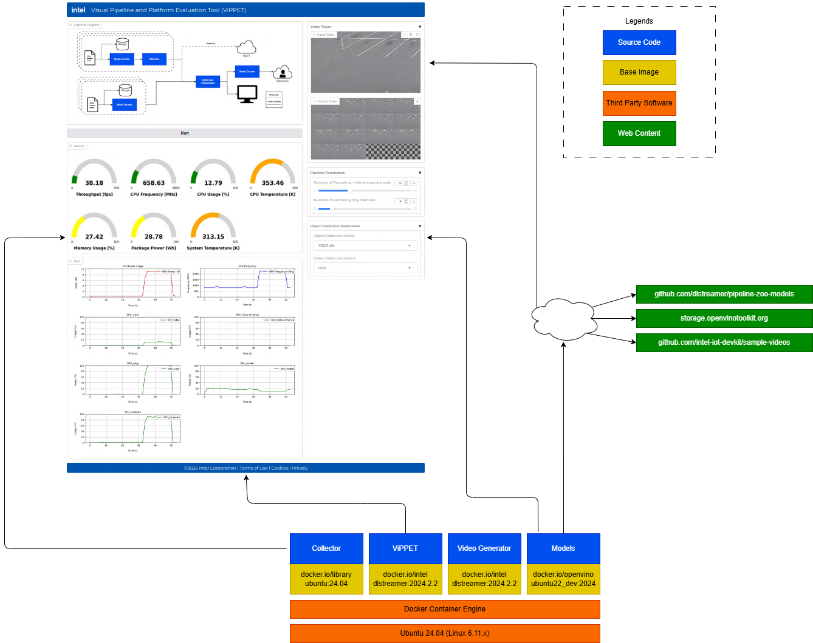

# Visual Pipeline and Platform Evaluation Tool
<!-- required for catalog, do not remove -->
Assess Intel® hardware options, benchmark performance, and analyze key metrics to optimize hardware selection for AI workloads.

<!--
**Guidelines for Authors**:
- Clearly explain the application’s purpose in one or two paragraphs.
- Describe the primary domain and high-level goal.
- Follow Microsoft Writing Guidelines: Use direct, active voice and avoid unnecessary jargon.
-->

## Overview
The Visual Pipeline and Platform Evaluation Tool simplifies hardware selection for AI workloads by allowing you to configure workload parameters, benchmark performance, and analyze key metrics such as throughput, CPU, and GPU usage. With its intuitive interface, the tool provides actionable insights to help you optimize hardware selection and performance.

### Use Cases

<!--
**Guidelines for Authors**:
- Provide two or three real-world use cases in "Problem → Solution → Outcome" format.
- Ensure use cases are practical and highlight unique features of the application.
-->

**Evaluating Hardware for AI Workloads**: Assess Intel® hardware options to balance cost, performance, and efficiency. Benchmark AI workloads under real-world conditions by adjusting pipeline parameters and comparing performance metrics.

**Performance Benchmarking for AI Models**: Ensure your models meet performance goals and KPIs. Test AI inference pipelines with different accelerators to measure throughput, latency, and resource utilization.

### Key Features

<!--
**Guidelines for Authors**:
- Clearly highlight value propositions.
- Use concise, benefit-driven statements.
-->

**Optimized for Intel® AI Edge Systems**: Run the pipeline directly on target devices for seamless Intel® hardware integration.

**Comprehensive Hardware Evaluation**: Access metrics like CPU frequency, GPU power usage, memory utilization, and system temperature.

**Configurable AI Pipelines**: Adjust parameters like input channels, object detection models, and inference engines for tailored performance tests.

**Automated Video Generation**: Generate synthetic test videos to evaluate system performance under controlled conditions.

## How It Works

<!--
**Guidelines for Authors**:
- Use a high-level diagram to illustrate the system.
- Describe the key processing steps in a structured workflow.
-->

The Visual Pipeline and Platform Evaluation Tool integrates with AI-based video processing pipelines to help you evaluate hardware performance.

### **Workflow Overview**

**Data Ingestion**: Provide video streams from live cameras or recorded files. Configure pipeline parameters to match your evaluation needs.

**AI Processing**: Apply AI inference using OpenVINO™ models to detect objects in video streams. 

**Performance Evaluation**: Collect hardware performance metrics, including CPU/GPU usage, power consumption, and thermal data.

**Visualization & Analysis**: View real-time performance metrics on the dashboard to compare configurations and optimize settings.

## Learn More
- [System Requirements](docs/user-guide/system-requirements.md)
- [Get Started](docs/user-guide/get-started.md)
- [How to Build Source](docs/user-guide/how-to-build-source.md)
- [How to use Video Generator ](docs/user-guide/how-to-use-video-generator.md)
- [Release Notes](docs/user-guide/release-notes.md)